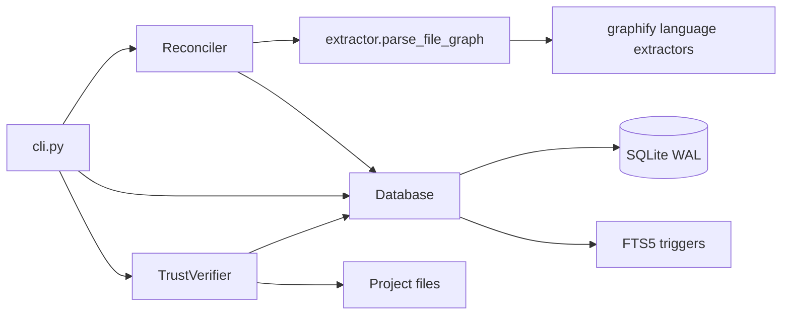
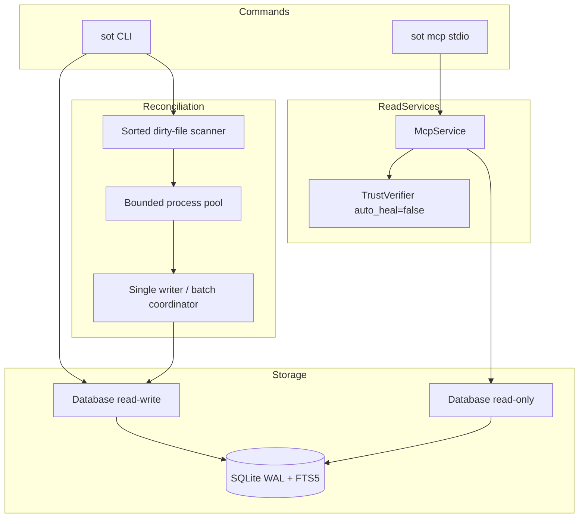

# sot-graph v2 Production Enhancement Specification

**Status:** Implementation-ready design
**Scope:** `src/sot_graph/`, CLI integration, storage maintenance, parallel reconciliation, MCP stdio serving, correctness tests, and performance benchmarks
**Compatibility target:** Python 3.10+, existing `sot` command, existing SQLite database format

## 1. Executive decision

sot-graph v2 will preserve the current single-process CLI and SQLite data model while introducing four isolated capabilities:

1. `sot mcp`: a read-only Model Context Protocol server over stdio.
2. `sot clean` and `sot vacuum`: explicit, safe database maintenance commands.
3. Parallel file extraction: bounded worker processes feeding deterministic, single-writer SQLite batch commits.
4. A repeatable correctness and performance benchmark suite.

The core architectural rule is unchanged: extraction may run concurrently, but SQLite mutation remains serialized. MCP is read-only. Maintenance commands acquire exclusive write access. No new database format is required.

## 2. Goals and non-goals

### 2.1 Goals

- Expose trusted search, graph exploration, drift inspection, and graph statistics to MCP clients without allowing MCP-triggered database mutation.
- Make stale-index cleanup and physical database compaction explicit, observable, and safe.
- Reduce cold and incremental reconciliation wall time on multi-core hosts without changing logical graph results.
- Bound worker count, in-flight work, memory, transaction size, and failure blast radius.
- Preserve deterministic logical database contents across worker counts and completion order.
- Add behavioral tests for every new command and concurrency invariant.
- Add a benchmark harness with machine-readable output and controlled regression gates.
- Preserve existing CLI behavior and the current SQLite schema unless a later implementation proves a schema change necessary.

### 2.2 Non-goals

- Network MCP transports such as HTTP, SSE, or WebSocket. v2 supports stdio only.
- MCP write tools, remote reconciliation, note insertion, cleanup, or vacuum.
- Multiple concurrent SQLite writers.
- Distributed workers or a persistent extraction daemon.
- Replacing SQLite, FTS5, the graphify AST extractors, or the trust-verification model.
- Introducing an application framework or general-purpose service container.

## 3. Current architecture

### 3.1 Package and command surface

`pyproject.toml` defines package `sot-graph` version `0.1.0`, Python `>=3.10`, the `setuptools.build_meta` backend, and the console script:

```text
sot = sot_graph.cli:main
```

The current runtime is primarily standard-library Python plus the graphify extraction code. Tests use `unittest` and run with:

```bash
python3 -m unittest discover tests
```

`src/sot_graph/cli.py:176-245` owns the top-level `argparse` parser and dispatch. Existing commands are `search`, `explore`, `insert`, `reconcile`, `verify`, and `doctor`. Global `--root` defaults to the current directory; global `--db` defaults to `<root>/.sot/sot.db`. `main()` closes the database in a `finally` block. Existing success uses exit code 0; runtime or negative-result conditions use 1; `argparse` owns usage errors.

### 3.2 Module boundaries

| Module | Current responsibility | v2 boundary |
|---|---|---|
| `src/sot_graph/cli.py` | Parser, command dispatch, human/JSON output | Parse only; delegate behavior to storage, reconciler, or MCP service |
| `src/sot_graph/db.py` | SQLite connection, schema, FTS5 triggers, CRUD, search, traversal, statistics | Add connection modes, maintenance operations, batch commits, set-based pending-edge resolution |
| `src/sot_graph/extractor.py` | Language detection and per-file graph extraction | Remain a stateless, picklable worker boundary |
| `src/sot_graph/reconciler.py` | Dirty checking, sequential extraction, commits, deletion reconciliation, drift audit | Coordinate bounded workers and the single writer |
| `src/sot_graph/verifier.py` | Disk coverage and trust verdicts; currently may rehome or delete stale hits | Add an explicit non-mutating mode for MCP |
| `src/sot_graph/mcp_server.py` | New | MCP protocol registration and stdio lifecycle |
| `src/sot_graph/mcp_service.py` | New | Protocol-independent, read-only query facade |

Two flat MCP modules are preferred over a new package: the surface is small and does not justify another package hierarchy.

### 3.3 Data flow



### 3.4 Extraction and reconciliation

- `src/sot_graph/extractor.py:65-206` contains language dispatch and `parse_file_graph(path, root_dir)`. It reads and hashes one file, creates the file node, normalizes extracted symbols, creates intra-file edges, and emits unresolved cross-file edges as pending edges.
- Per-file extraction has no required shared mutable state and is the correct multiprocessing boundary.
- `src/sot_graph/reconciler.py:25-69` currently executes dirty check, parse, `Database.commit_file()`, and `Database.resolve_pending_edges()` sequentially for one path.
- `src/sot_graph/reconciler.py:71-96` walks the tree and invokes that path one file at a time, then deletes database paths absent from disk.
- `src/sot_graph/reconciler.py:98-128` provides non-mutating shallow or deep drift auditing.

### 3.5 SQLite storage

`src/sot_graph/db.py:11-87` defines:

- `file_journal`: path, hash, size, mtime, generation, and reconciliation timestamp.
- `graph_nodes`: file and symbol nodes.
- `graph_edges`: resolved relationships.
- `pending_edges`: unresolved cross-file relationships.
- `graph_fts`: FTS5 external-content index synchronized from `graph_nodes` by insert, update, and delete triggers.

`Database.__init__` at `src/sot_graph/db.py:90-101` creates the parent directory, opens SQLite, enables WAL, uses `synchronous=NORMAL`, enables foreign keys, and initializes the schema. `Database.close()` exists at line 104.

`Database.commit_file()` at `src/sot_graph/db.py:153-201` atomically replaces one path's graph rows and journal entry. `resolve_pending_edges()` at lines 203-258 resolves cross-file relationships. `search_fts()` at lines 256-291 performs FTS5/BM25 search. `explore_node()` at lines 293-353 performs bounded graph traversal. `stats()` at lines 355-365 returns path, node, edge, and pending counts.

### 3.6 Trust verification constraint

`TrustVerifier.verify_hit()` at `src/sot_graph/verifier.py:36-120` is not read-only today. A missing path may be rehomed through `Database.update_node_path()` or deleted through `Database.delete_path()`. MCP cannot call that behavior through a read-only connection. v2 must separate verification from healing with an explicit `auto_heal` policy.

## 4. Target architecture and cross-cutting contracts



### 4.1 Database connection modes

Extend `Database` without breaking existing callers:

```python
class Database:
    def __init__(
        self,
        db_path: str,
        *,
        read_only: bool = False,
        timeout_ms: int = 5_000,
        initialize: bool = True,
    ) -> None: ...
```

Required behavior:

- Default arguments retain current read-write behavior.
- Read-write mode creates the parent directory, opens the file, applies WAL, `synchronous=NORMAL`, foreign keys, `busy_timeout`, and schema initialization.
- Read-only mode:
  - Requires the database to exist.
  - Opens with a SQLite URI using `mode=ro`.
  - Does not create directories, apply schema DDL, change journal mode, checkpoint, or write.
  - Applies safe connection-local settings such as `query_only=ON` and `busy_timeout` where SQLite permits them.
- `timeout_ms` is consistently used for SQLite connection timeout and busy handling.
- Connection ownership remains explicit through `close()`; adding `__enter__`/`__exit__` is optional and must not replace existing `finally` cleanup.
- MCP must not share a default `sqlite3.Connection` across arbitrary executor threads.

### 4.2 Output and exit codes

All new commands must support deterministic human-readable output and `--json` where the command produces a finite result.

| Exit | Meaning |
|---:|---|
| 0 | Operation completed successfully |
| 1 | Runtime failure, database busy/corrupt, protocol startup failure, or partial reconciliation failure |
| 2 | Invalid CLI usage, owned by `argparse` |
| 130 | Interrupted by SIGINT before normal completion |

JSON output must contain stable keys, no terminal decoration, and no progress lines on stdout. Diagnostics and progress go to stderr when `--json` is active. MCP stdout is always protocol-only.

### 4.3 Path boundary

- Resolve `--root` once with `realpath`/`Path.resolve()`.
- Every filesystem path read by trust verification or drift audit must resolve inside that root.
- Database paths may be explicitly supplied outside the root through the existing `--db` option, but database-returned source paths do not grant filesystem access outside the root.
- Reject escaping paths with a typed permission/input error; do not silently read them.

## 5. MCP stdio server: `sot mcp`

### 5.1 CLI contract

```text
sot [--root ROOT] [--db DB] mcp [--log-level {error,warning,info,debug}] [--request-timeout SECONDS]
```

Defaults:

- Transport: stdio; no transport flag because v2 supports no alternative.
- `--log-level`: `warning`.
- `--request-timeout`: `10.0`, constrained to a positive finite value.
- Database: read-only.

Startup behavior:

1. Resolve root and database path.
2. Import the optional MCP SDK only inside the MCP command path.
3. If unavailable, write an actionable message to stderr and return 1:
   `MCP support requires optional dependencies; install sot-graph[mcp].`
4. Validate that the database exists and can be opened read-only.
5. Start the async stdio transport. Do not construct the normal read-write `Database` first.
6. Close the service executor and database connection on EOF, cancellation, SIGINT, or protocol shutdown.

No `--port`, HTTP mode, implicit reconcile, database creation, auto-healing, or write tool is permitted.

### 5.2 Dependency policy

Add an optional dependency group in `pyproject.toml`:

```toml
[project.optional-dependencies]
mcp = ["mcp>=1.3.0,<2.0.0"]
```

Use the stable low-level SDK surface:

```python
from mcp.server import Server
from mcp.server.models import InitializationOptions
from mcp.server.stdio import stdio_server
import mcp.types as types
```

Pin below 2.0 for v2 implementation stability. Upgrade to MCP SDK 2.x must be a deliberate follow-up with its migration guide and protocol integration tests. Primary references:

- https://github.com/modelcontextprotocol/python-sdk
- https://py.sdk.modelcontextprotocol.io/
- https://py.sdk.modelcontextprotocol.io/migration/
- https://modelcontextprotocol.io/docs/

### 5.3 Service lifecycle and threading

`McpService` is protocol-independent and owns read-only access. Use one of these equivalent safe implementations, in preference order:

1. A dedicated `ThreadPoolExecutor(max_workers=1)` whose initializer creates the SQLite connection and whose shutdown path closes it on the same thread.
2. A fresh short-lived read-only connection per request if measurement shows connection setup is negligible.

Do not create one connection on the event-loop thread and use it from arbitrary `asyncio.to_thread()` workers. Do not set `check_same_thread=False` as a substitute for ownership.

All blocking SQLite and disk verification runs off the async stdio loop. Bound tool duration with `--request-timeout`. Cancellation stops awaiting and prevents new work; SQLite queries must remain intrinsically bounded through result limits and traversal depth. Late results after cancellation are discarded.

### 5.4 Read-only verification

Change the verifier signature compatibly:

```python
TrustVerifier.verify_hit(
    db,
    candidate,
    query_tokens,
    project_root,
    threshold=0.5,
    *,
    auto_heal=True,
)
```

- Existing CLI search retains `auto_heal=True`.
- MCP passes `auto_heal=False`.
- With `auto_heal=False`, existing files still receive coverage-based `STRONG` or `WEAK` verdicts.
- Missing or moved files return a non-mutating stale verdict and never call `update_node_path()` or `delete_path()`.
- The result contract must distinguish `STALE` from a verified empty result.

### 5.5 Tool contracts

All tools return one MCP text content item containing canonical JSON. Validation rejects additional properties. Internal exceptions are logged to stderr; tool errors return a stable public error code and message without SQL, stack trace, or arbitrary host paths.

#### `sot_search`

Search FTS5 and apply non-mutating trust verification.

Input:

```json
{
  "type": "object",
  "properties": {
    "query": {"type": "string", "minLength": 1, "maxLength": 1000},
    "limit": {"type": "integer", "minimum": 1, "maximum": 50, "default": 6},
    "scope": {"type": ["string", "null"], "maxLength": 4096, "default": null},
    "threshold": {"type": "number", "minimum": 0.0, "maximum": 1.0, "default": 0.5}
  },
  "required": ["query"],
  "additionalProperties": false
}
```

Output:

```json
{
  "query": "Database",
  "results": [
    {
      "id": "sym:...",
      "path": "src/sot_graph/db.py",
      "kind": "class",
      "symbol": "Database",
      "label": "Database",
      "line_start": 90,
      "body": "...",
      "rank_score": -1.23,
      "verdict": "STRONG",
      "coverage": 1.0
    }
  ],
  "returned": 1,
  "stale": 0
}
```

Rules:

- Map to `Database.search_fts()` and `TrustVerifier.verify_hit(auto_heal=False)`.
- Query up to the existing candidate multiplier but return no more than `limit` verified results.
- Return repository-relative paths only.
- Bound returned body text per result and total serialized response size; recommended defaults are 8 KiB per body and 256 KiB per response.

#### `sot_explore`

Traverse relationships from an exact node returned by search.

Input:

```json
{
  "type": "object",
  "properties": {
    "node_id": {"type": "string", "minLength": 1, "maxLength": 512},
    "depth": {"type": "integer", "minimum": 1, "maximum": 4, "default": 1},
    "limit": {"type": "integer", "minimum": 1, "maximum": 500, "default": 100}
  },
  "required": ["node_id"],
  "additionalProperties": false
}
```

Output:

```json
{
  "node_id": "sym:...",
  "depth": 1,
  "relations": [
    {"direction": "out", "relation": "calls", "source": "sym:...", "target": "sym:...", "path": "src/..."}
  ],
  "truncated": false
}
```

Rules:

- Map to a limit-aware form of `Database.explore_node()`.
- The node identifier is exact; MCP does not silently choose among ambiguous symbol labels.
- Enforce both depth and total relation limit at the SQL/service boundary.

#### `sot_verify_drift`

Perform a read-only disk-to-journal audit.

Input:

```json
{
  "type": "object",
  "properties": {
    "deep": {"type": "boolean", "default": false},
    "limit": {"type": "integer", "minimum": 1, "maximum": 1000, "default": 100}
  },
  "additionalProperties": false
}
```

Output:

```json
{
  "deep": false,
  "drift_count": 2,
  "items": [{"path": "src/example.py", "reason": "modified"}],
  "truncated": false
}
```

Rules:

- Map to `Reconciler.audit_drift()` using the same read-only database.
- Never call reconciliation or mutate journal timestamps.
- Return only root-contained, repository-relative paths.

### 5.6 Resource contracts

- `sot://stats`
  - MIME type: `application/json`.
  - Body: `Database.stats()` plus database schema/package version where available.
  - Keys: `paths`, `nodes`, `edges`, `pending`.
- Resource template `sot://node/{node_id}`
  - MIME type: `application/json`.
  - Percent-decode and validate `node_id`.
  - Return exact node metadata plus immediate relationships, bounded to 100.
  - Unknown nodes return the MCP resource-not-found error.

### 5.7 Protocol and security invariants

- stdout contains only MCP JSON-RPC traffic. Every log, warning, and diagnostic uses `logging` on stderr.
- A protocol-level integration test must initialize through the SDK client rather than relying only on hand-written JSON lines; MCP framing may evolve independently of JSON-RPC payload shape.
- Tool names and schemas are stable public API for the v2 line.
- Search and traversal parameters are bound SQL parameters.
- The read-only URI is not a security boundary by itself; service methods are the only public operations.
- MCP never returns absolute database paths, SQLite errors, stack traces, or content outside `--root`.
- An active read-only MCP server may coexist with WAL-mode reconciliation. Maintenance requiring exclusive access may fail cleanly while readers are active.

## 6. Database maintenance

### 6.1 `sot clean` CLI

```text
sot [--root ROOT] [--db DB] clean [--dry-run] [--all] [--include-notes] [--yes] [--json]
```

#### Default mode: stale cleanup

Default `sot clean` is conservative and non-interactive. It:

1. Compares journaled paths with the project filesystem.
2. Deletes rows for confirmed missing tracked paths through the same semantics as `Database.delete_path()`.
3. Removes orphaned resolved edges whose endpoint node no longer exists.
4. Removes pending edges whose source node or source path no longer exists.
5. Leaves existing tracked paths, user notes, valid unresolved cross-file pending edges, schema objects, and the database file untouched.
6. Relies on existing graph-node delete triggers to keep external-content FTS5 synchronized.

A path that cannot be inspected due to permission or transient I/O failure is reported as an error, not classified as missing.

#### Reset mode

- `--all` deletes all generated file/symbol graph data and journal rows but preserves standalone user notes by default.
- `--all --include-notes` deletes all graph content, including `kind='note'` / `note:` records, leaving an initialized empty schema.
- `--include-notes` without `--all` is invalid.
- Destructive reset requires either an interactive exact confirmation or `--yes`.
- Non-interactive stdin without `--yes` fails with exit 1; it never assumes consent.

#### Dry run and output

- `--dry-run` performs the full classification and reports exact candidate counts but executes no DML, FTS rebuild, journal update, or timestamp mutation.
- `--dry-run --all` does not require confirmation.
- Human output reports paths, nodes, resolved edges, pending edges, and notes selected for deletion.
- JSON output contract:

```json
{
  "mode": "stale",
  "dry_run": true,
  "deleted": {"paths": 0, "nodes": 0, "edges": 0, "pending": 0, "notes": 0},
  "errors": [],
  "duration_ms": 3
}
```

#### Storage API

```python
@dataclass(frozen=True)
class CleanPlan:
    mode: str
    paths: tuple[str, ...]
    counts: dict[str, int]

class Database:
    def plan_clean(self, root_dir: str, *, reset: bool = False, include_notes: bool = False) -> CleanPlan: ...
    def apply_clean(self, plan: CleanPlan) -> dict[str, int]: ...
```

Planning and application are separate so dry-run and destructive confirmation use the exact same classified plan. `apply_clean()` executes one transaction. It revalidates missing paths immediately before deletion to narrow time-of-check/time-of-use races. A reset deletes rows; it does not drop/recreate schema or triggers.

### 6.2 `sot vacuum` CLI

```text
sot [--root ROOT] [--db DB] vacuum [--analyze] [--dry-run] [--json]
```

Behavior:

1. Open the database read-write with the configured busy timeout.
2. Reject operation if a transaction is active.
3. Collect pre-operation metrics: database bytes, WAL bytes, page size, page count, freelist pages, and estimated reclaimable bytes.
4. In dry-run mode, report estimates only and make no PRAGMA that mutates persistent state.
5. In execution mode, run `PRAGMA wal_checkpoint(TRUNCATE)` and require a successful non-busy result.
6. Run `VACUUM` in autocommit mode, never inside `with self.conn:`.
7. If `--analyze` is present, run `PRAGMA optimize` after vacuum. Do not run both unrestricted `ANALYZE` and `PRAGMA optimize` without measured need.
8. Collect post-operation metrics and report actual byte/page delta.

Storage API:

```python
class Database:
    def vacuum(self, *, optimize: bool = False, dry_run: bool = False) -> VacuumResult: ...
```

`VacuumResult` contains before/after sizes, page metrics, checkpoint status, elapsed time, and whether optimize ran.

Safety requirements:

- `VACUUM` needs an exclusive lock and temporary disk space up to approximately the database size. Check available filesystem space before starting and fail with a clear diagnostic if insufficient.
- Do not retry indefinitely. Respect `timeout_ms`; return 1 with a database-busy message if readers/writers prevent checkpoint or vacuum.
- Never delete `-wal` or `-shm` files directly.
- On failure, leave the original database valid and report the SQLite operation that failed without exposing a stack trace in normal output.

## 7. Parallel batch extraction and reconciliation

### 7.1 CLI contract

Extend reconcile without changing default command meaning:

```text
sot [--root ROOT] [--db DB] reconcile [PATH ...] [--workers N] [--batch-size N] [--json]
```

- `--workers`: integer `>=1`; default `min(8, max(1, os.cpu_count() or 1))`. `1` is the reference sequential mode.
- `--batch-size`: integer `>=1`; default `64` files per transaction window.
- Existing reconcile arguments and path semantics remain unchanged; the implementation must merge these flags into the current parser rather than replace it.
- For zero or one dirty file, avoid process-pool startup and use the sequential path.

### 7.2 Data contracts

Introduce explicit picklable records, defined at module scope:

```python
@dataclass(frozen=True)
class ParseJob:
    path: str
    root_dir: str
    size: int
    mtime_ms: int

@dataclass(frozen=True)
class ParseResult:
    path: str
    sha256: str | None
    size: int
    mtime_ms: int
    nodes: tuple[dict, ...]
    edges: tuple[dict, ...]
    pending: tuple[dict, ...]
    error: str | None = None

@dataclass(frozen=True)
class ReconcileSummary:
    scanned: int
    unchanged: int
    updated: int
    deleted: int
    failed: int
    duration_ms: int
```

Do not pass `Database`, SQLite connections, open files, loggers, callbacks, or mutable coordinator state into worker processes.

### 7.3 Control flow

1. Walk supported files using current ignore/language rules.
2. Normalize repository-relative paths and sort lexicographically.
3. Compare stat metadata and journal entries; hash only when current dirty-check semantics require it.
4. Split dirty paths into deterministic windows of `batch_size`.
5. For each window:
   - Submit at most the window size to a `ProcessPoolExecutor(max_workers=workers)`.
   - Bound outstanding futures to at most `min(batch_size, workers * 2)` by incremental submission.
   - Parse files independently through a module-level worker calling `parse_file_graph()`.
   - Gather the complete window, classify failures, and sort successful results by normalized path.
   - Commit successful results through one `Database.commit_file_batch()` transaction.
6. Delete paths confirmed absent from disk through the single writer.
7. After all successful commits and deletions, execute one set-based pending-edge resolution transaction.
8. Emit the summary and return nonzero if any file failed.

The per-window barrier is intentional. It provides deterministic transaction membership and bounded memory without buffering the full repository.

### 7.4 Single-writer storage API

```python
class Database:
    def commit_file_batch(self, records: Sequence[ParseResult]) -> int: ...
    def resolve_all_pending_edges(self) -> int: ...
```

`commit_file_batch()` must:

- Assert or document that it is called only by the coordinator thread/process.
- Sort defensively by normalized path.
- Execute all deletes, node inserts, edge inserts, pending inserts, and journal upserts for the batch inside one transaction.
- Use `executemany()` for homogeneous statements.
- Preserve existing FTS5 trigger behavior.
- Roll back the complete batch if any row violates an invariant.
- Preserve `commit_file()` as a thin one-record call into `commit_file_batch()` so existing callers and tests remain valid.

`resolve_all_pending_edges()` must use set-based SQL joins where possible, promote each resolvable pending edge exactly once, and remove only successfully promoted pending rows. Results must be equivalent to the current two-way per-file resolution regardless of commit order.

### 7.5 Determinism invariants

- Normalized path order determines batches and write order, never future-completion order.
- File and symbol IDs remain functions of current normalized inputs; concurrency must not introduce counters, random values, process IDs, or completion timestamps into identity.
- Duplicate rows use the existing primary-key/upsert semantics.
- Logical equivalence is measured by canonical ordered dumps of application tables, excluding documented volatile timestamp columns. Physical SQLite files are not expected to be byte-identical because page layout, rowids, WAL state, and timestamps may differ.
- Worker counts 1, 2, and auto must produce identical canonical rows and trust/search results for the same repository snapshot.

### 7.6 Failure and cancellation

- One file parse failure does not erase its last known-good rows or advance its journal entry.
- Remaining files continue; final exit is 1 and summary `failed` is nonzero.
- A file disappearing between scan and parse is re-stat'ed. If confirmed absent, handle it as a deletion; a permission/transient I/O error is a failure.
- A failed batch transaction rolls back every record in that batch; prior committed batches remain valid and resumable.
- On SIGINT, the coordinator stops submitting work, cancels futures not yet running, rolls back an active transaction, shuts down workers, closes the database, and exits 130.
- Worker processes ignore SIGINT so the coordinator owns cancellation.
- Worker exception payloads contain stable error categories and repository-relative paths, not pickled arbitrary exceptions or full tracebacks.
- Process-pool breakage is a command failure; do not silently fall back to sequential execution after partial parallel writes.

### 7.7 Progress and memory

- Human mode may report scanned/dirty/completed/failed counters to stderr when attached to a terminal.
- JSON mode emits no progress on stdout.
- The bounded future count plus batch window is the memory-control mechanism. Do not use an unbounded `executor.map()` over all files.
- Avoid copying AST result structures beyond worker serialization, one result buffer, and the current transaction batch.

## 8. Test specification

All permanent tests use `unittest`, temporary directories, deterministic fixtures, and isolated temporary SQLite files. Tests must assert observable behavior, not source text or implementation details.

### 8.1 Database connection and maintenance tests

Create `tests/test_maintenance.py`:

- Read-only open succeeds for an existing initialized DB and cannot execute DML.
- Read-only open of a missing DB fails without creating a directory or file.
- `clean --dry-run` leaves every application table, FTS result, journal timestamp, and file size unchanged.
- Default clean removes a missing tracked path from journal, nodes, source-owned edges, and pending edges while preserving live paths and notes.
- Permission/stat failure is reported and not treated as deletion.
- Orphan cleanup removes invalid rows but retains valid unresolved pending edges.
- `--all` preserves notes; `--all --include-notes` leaves zero application rows and a usable schema.
- Reset confirmation is required; `--yes` bypasses it; non-interactive destructive invocation without `--yes` fails safely.
- FTS search after clean returns no deleted node and still returns retained nodes.
- Vacuum runs outside a transaction, survives WAL mode, reduces a deliberately bloated database, and leaves `PRAGMA quick_check` equal to `ok`.
- Vacuum dry-run does not checkpoint, change page counts, or change file bytes.
- Busy-lock vacuum exits 1 within the configured timeout and does not damage data.
- JSON output is valid and contains the specified keys.

### 8.2 Parallel reconciliation tests

Create `tests/test_parallel_reconciler.py`:

- Worker counts 1, 2, and 4 produce identical canonical table snapshots.
- Deliberately reversed completion order still commits canonical path order.
- Batch sizes 1, 7, and larger than the dirty set are logically equivalent.
- Cross-file edges resolve when source and destination land in different batches and in either lexical order.
- Re-running an unchanged tree is idempotent.
- A 5% dirty update changes only corresponding journal generations and graph rows.
- Deleted files are purged after parallel extraction.
- One parser failure preserves that path's previous graph, commits other successful paths, and returns a partial-failure summary.
- A batch constraint failure rolls back only that batch.
- Simulated cancellation leaves `PRAGMA quick_check` healthy and a subsequent run converges to the sequential reference.
- Outstanding submitted jobs never exceed the configured bound; test through an injected executor/future seam rather than timing.
- FTS search and graph exploration results match the sequential reference.

### 8.3 MCP tests

Create `tests/test_mcp.py`, skipped only when the optional MCP dependency is absent:

- CLI without the extra returns 1 and prints install guidance to stderr.
- SDK client initialization succeeds over subprocess stdio.
- `tools/list` exposes exactly the documented v2 tools and schemas.
- `resources/list`/template listing exposes stats and node resources.
- Search results match the existing CLI/service query contract while leaving database rows unchanged for stale hits.
- Explore rejects ambiguous labels and unknown IDs; exact IDs return bounded relations.
- Drift audit shallow/deep is read-only and root-contained.
- Invalid arguments produce protocol/tool errors without stack traces.
- Timeout/cancellation does not corrupt the next request.
- A concurrent reconcile writer and MCP reader operate successfully under WAL.
- Captured stdout contains protocol frames only; logs appear only on stderr.
- Shutdown on EOF closes the database and executor without hanging.

### 8.4 Existing regression suite

The existing `tests/test_sot_graph.py` and `tests/test_multilang.py` must remain green. Existing `commit_file()`, CLI search, explore, verify, note insertion, and reconciliation behavior must not require compatibility aliases or deprecated command paths.

## 9. Benchmark specification

### 9.1 Harness layout

Add:

```text
benchmarks/
  __init__.py
  fixtures.py
  bench_reconcile.py
  bench_query.py
```

Run examples:

```bash
python3 -m benchmarks.bench_reconcile --files 5000 --workers 1,2,4,8 --repeat 5 --json results.json
python3 -m benchmarks.bench_query --queries 1000 --repeat 5 --json query-results.json
```

Benchmarks are not part of default `unittest` discovery. Correctness tests remain mandatory in CI; performance gates run on a pinned runner or explicit benchmark job.

### 9.2 Deterministic fixture corpus

Generate repositories from a fixed seed with valid Python, TypeScript, Go, Rust, and Markdown files. Sizes: 100 for smoke, 1,000 for local comparison, and 5,000+ for controlled CI. Include:

- Small, medium, and large files.
- Intra-file and cross-file symbol references.
- Repeated terms for FTS5.
- Zero-change warm run.
- 5% modified files.
- 5% deleted files.
- One deterministic parse failure fixture for non-performance correctness only.

Record seed, language mix, byte count, file count, CPU count, Python version, SQLite version, OS, worker count, batch size, and commit SHA in every result.

### 9.3 Reconciliation scenarios and metrics

Scenarios:

1. Cold empty-database reconcile.
2. Warm no-op reconcile.
3. Warm 5% dirty reconcile.
4. Warm 5% deletion reconcile.
5. Single-worker reference versus 2/4/8/auto workers.
6. Batch sizes 1/16/64/256.

Metrics:

- Wall-clock median, p95, and minimum over at least five measured repetitions after one warm-up.
- Files/second and MiB/second.
- Peak RSS for coordinator and complete worker tree.
- CPU utilization where the platform exposes it reliably.
- Database bytes, WAL bytes, transaction count, nodes, edges, pending edges, and FTS result counts.
- Canonical logical snapshot hash.
- Failures and retries, which must be zero in performance fixtures.

Use `time.perf_counter_ns()`. Prefer `resource.getrusage()` on supported Unix hosts; clearly mark unavailable metrics rather than substituting estimates. Do not include fixture generation in reconcile timing.

### 9.4 Query and MCP scenarios

- Direct `Database.search_fts()` p50/p95 for fixed common, rare, and no-hit queries.
- `Database.explore_node()` at depths 1-4 with bounded result counts.
- MCP stdio end-to-end p50/p95 for initialized-session tool calls, excluding process startup and initialization.
- Database stats resource latency.
- Concurrent MCP read latency while reconciliation writes in WAL mode.

### 9.5 Correctness gates

Every benchmark run must first verify:

- `PRAGMA quick_check` is `ok`.
- Canonical application-table hashes match the single-worker reference, excluding documented volatile timestamp fields.
- Node, edge, pending-edge, and journal counts match.
- A fixed query corpus returns the same ordered IDs and trust verdicts.
- Three repeated parallel builds converge to the same canonical hash.

A correctness mismatch invalidates the performance result.

### 9.6 Performance gates

Performance gates apply only on a pinned, otherwise idle runner. Store the runner fingerprint with the baseline.

Initial v2 acceptance targets:

- On a corpus of at least 2,000 dirty files and an 8-logical-CPU runner, auto workers achieve at least 2.0x cold-reconcile throughput over `--workers 1` at identical logical output.
- Warm no-op reconciliation is no more than 10% slower than the v1/single-worker baseline median.
- Peak aggregate RSS is no greater than `max(256 MiB, 1.5x single-worker RSS)` on the 5,000-file fixture.
- Query p95 is no more than 10% slower than the pre-v2 direct-database baseline.
- MCP initialized-session p95 remains below 2x direct service-call p95 plus 10 ms transport allowance on the pinned runner.
- A pull request fails the performance job only after the median crosses a threshold on two consecutive benchmark executions, reducing one-run noise.

These are release gates, not universal hardware promises. Machine-independent correctness and bounded-submission tests remain the primary CI gates.

## 10. Implementation plan

### Phase 1: storage contracts

Files:

- `src/sot_graph/db.py`
- `tests/test_maintenance.py`

Work:

1. Add read-only and timeout connection options while preserving default construction.
2. Add typed maintenance plan/result records.
3. Implement clean planning/application and vacuum lifecycle.
4. Add `busy_timeout` consistently.
5. Verify FTS and quick-check invariants.

Exit criteria: read-only access and both maintenance operations pass isolated behavioral tests.

### Phase 2: maintenance CLI

Files:

- `src/sot_graph/cli.py`
- `tests/test_maintenance.py`

Work:

1. Register `clean` and `vacuum` parsers.
2. Implement confirmation, JSON/human output, and exit codes.
3. Ensure vacuum is not wrapped in a transaction.
4. Preserve global root/database option semantics.

Exit criteria: subprocess CLI tests prove dry-run, destructive confirmation, JSON, busy failure, and successful reuse after maintenance.

### Phase 3: batch storage

Files:

- `src/sot_graph/db.py`
- `tests/test_parallel_reconciler.py`

Work:

1. Implement `commit_file_batch()`.
2. Route `commit_file()` through the batch method.
3. Replace per-file pending resolution with a set-based all-pending operation while preserving logical semantics.
4. Add canonical snapshot helpers in tests only.

Exit criteria: batch sizes produce the sequential reference graph and FTS results.

### Phase 4: parallel reconciler

Files:

- `src/sot_graph/reconciler.py`
- `src/sot_graph/extractor.py` only if a module-level picklable adapter is needed
- `src/sot_graph/cli.py`
- `tests/test_parallel_reconciler.py`

Work:

1. Add explicit job/result/summary records.
2. Implement sorted windows and bounded future submission.
3. Add single-writer batch commits, deletion pass, and final resolution.
4. Add failure, disappearance, pool-breakage, and SIGINT handling.
5. Expose worker/batch flags and stable summaries.

Exit criteria: concurrency, determinism, recovery, and bounded-memory behavioral tests pass.

### Phase 5: MCP service

Files:

- `pyproject.toml`
- `src/sot_graph/mcp_service.py`
- `src/sot_graph/mcp_server.py`
- `src/sot_graph/verifier.py`
- `src/sot_graph/db.py`
- `src/sot_graph/cli.py`
- `tests/test_mcp.py`

Work:

1. Add optional SDK dependency.
2. Add non-mutating verifier policy and limit-aware exploration.
3. Implement the single-thread-owned read service.
4. Register tools/resources and stdio lifecycle.
5. Add CLI lazy import and stderr-only logging.
6. Test through the official SDK client over subprocess stdio.

Exit criteria: MCP protocol tests, read-only invariants, cancellation, and concurrent WAL reading pass.

### Phase 6: benchmarks and release evidence

Files:

- `benchmarks/__init__.py`
- `benchmarks/fixtures.py`
- `benchmarks/bench_reconcile.py`
- `benchmarks/bench_query.py`
- CI benchmark configuration if the repository has a controlled runner

Work:

1. Add seeded fixture generation and environment fingerprinting.
2. Add canonical correctness validation before timing.
3. Record JSON results and compare controlled baselines.
4. Establish the initial v2 baseline only after correctness tests pass.

Exit criteria: benchmark results are repeatable, machine-described, logically equivalent, and meet the controlled-runner release targets.

## 11. Compatibility and migration

- Existing database files open without migration; no table or column change is required by this design.
- Existing commands and global options retain their names and semantics.
- `Database(db_path)` remains valid and read-write.
- `Database.commit_file()` remains available and becomes a one-record batch call.
- `TrustVerifier.verify_hit()` remains auto-healing by default; only MCP opts out.
- Existing sequential behavior remains reachable with `sot reconcile --workers 1`.
- New MCP dependencies are optional; normal installation and existing CLI commands do not import them.
- Any implementation discovery that requires a schema change must add explicit schema versioning and forward migration before changing DDL; it must not silently reinterpret existing rows.

## 12. Operational documentation requirements

Update the existing user-facing documentation and command help during implementation with:

- Installation of the MCP extra and a minimal client configuration using `sot --root <absolute-root> mcp`.
- Warning that MCP is stdio/read-only and stdout must remain protocol-only.
- Clean retention rules, reset confirmation, and dry-run examples.
- Vacuum exclusive-lock and free-space requirements.
- Worker/batch tuning guidance and `--workers 1` diagnostic mode.
- Benchmark commands and the distinction between portable correctness gates and pinned-runner performance gates.

Do not create compatibility aliases, deprecated flags, or parallel configuration sources.

## 13. Definition of done

v2 is complete only when all of the following are true:

1. `sot mcp` initializes through an official MCP SDK client, exposes the documented tools/resources, remains read-only, and emits no non-protocol stdout.
2. `sot clean` safely removes stale data, preserves notes by default, supports exact dry-run counts, and requires confirmation for reset.
3. `sot vacuum` checkpoints WAL, runs outside a transaction, reports reclaimed storage, handles busy readers, and leaves `PRAGMA quick_check` healthy.
4. Parallel reconciliation uses bounded worker processes and deterministic single-writer batch commits.
5. Parallel and sequential runs produce identical canonical logical tables, search results, graph traversal, and trust verdicts.
6. File failures and interruption preserve last known-good committed data and allow a later reconcile to converge.
7. Existing tests plus maintenance, parallel, and MCP suites pass under Python 3.10 and supported newer versions.
8. Controlled benchmarks meet the release targets and publish their environment fingerprint and JSON evidence.
9. Existing database files and existing CLI invocations continue to work without migration or optional MCP dependencies.
