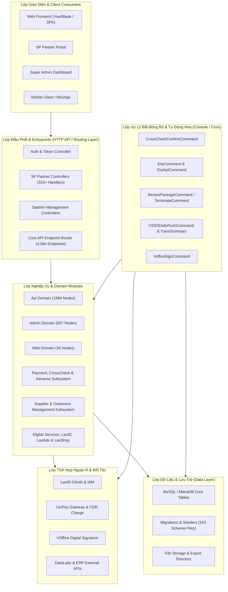
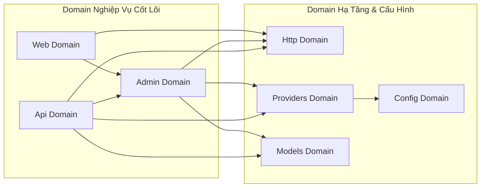
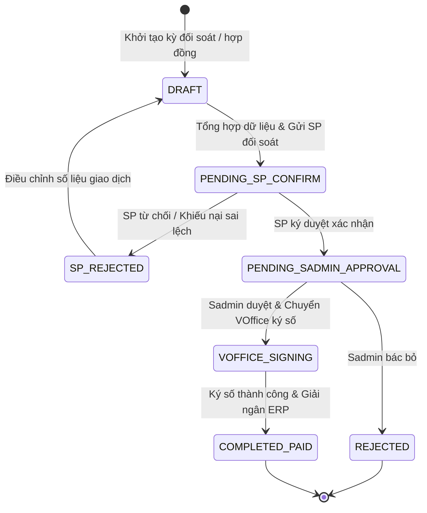
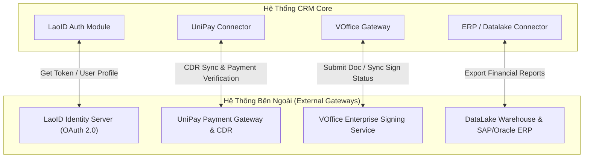
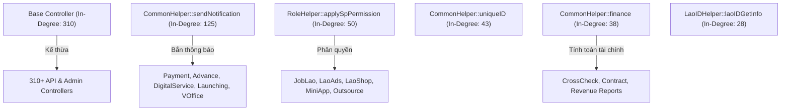
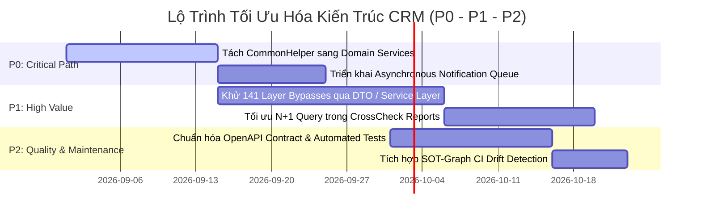

# BÁO CÁO ĐÁNH GIÁ KIẾN TRÚC HỆ THỐNG: CRM
> **Căn cứ phân tích:** SOT-Graph AST Engine & 5 Fact Bundles (`.sot/bundle/`)  
> **Repository:** `/Users/giapminh79/code/GitHub/crm`  
> **Mô hình kiến trúc:** Action-Domain-Responder / Modular Model-View-Controller (Laravel PHP)  
> **Chỉ số Modularity (Q):** 0.4767 (🟢 **STRONG MODULARITY** - Cấu trúc module phân tách rõ ràng)

---

## PHẦN 1: TỔNG QUAN HỆ THỐNG & ĐẶC TẢ KIẾN TRÚC TỔNG THỂ (EXECUTIVE SUMMARY & SYSTEM TOPOLOGY)

### 1.1 Thông Số Cốt Lõi (Architecture Metadata)

| Chỉ số Kiến trúc (Metric) | Giá trị Thực tế | Ý nghĩa & Đánh giá |
| :--- | :---: | :--- |
| **Primary Language / Framework** | `PHP 8.x` / `Laravel MVC` | Kiến trúc module hóa theo Laravel Modules (`nwidart/laravel-modules`). |
| **Tổng số Tập tin (Total Files)** | `3,019` files | Quy mô codebase lớn với 56 bounded modules chức năng. |
| **Tổng số AST Nodes / Symbols** | `10,785` nodes / `7,766` symbols | Mạng lưới thực thể, controller, helper và command dày đặc. |
| **Tổng số Liên kết Phân giải (Edges)** | `9,641` edges | Mật độ đồ thị D = 8.3 × 10⁻⁵, bậc kết nối trung bình K = 1.79. |
| **Chỉ số Modularity (Louvain Q)** | `0.4767` | **Phân tách phân hệ mạnh**, các module có ranh giới nghiệp vụ độc lập. |
| **Tổng số Cụm kiến trúc (Communities)** | `2,701` clusters | Các tính năng phân bổ thành các micro-domain nhỏ gọn. |
| **Tổng số Điểm nối (Discovered Routes)** | `4,813` routes | Bao gồm `4,584` HTTP APIs và `227` Event/Queue commands. |
| **Tổng số Vi phạm Kiến trúc (Violations)**| `141` layer bypasses | Tình trạng Controller gọi trực tiếp Helper hạ tầng bỏ qua Service layer. |

---

### 1.2 Mô Hình & Kiến Trúc Tổng Thể (System Architecture & Topology Diagram)

---

## PHẦN 2: PHÂN RÃ CÁC MODULE CHỨC NĂNG (BOUNDED FUNCTIONAL MODULES)

### 2.1 Bảng Danh Mục Module Chức Năng (Module Inventory)

| Module Chức Năng | Phân loại | Trách nhiệm Nghiệp vụ Chính | Thực thể Cốt lõi / Models | Entrypoints / Controllers | Nodes / Files |
| :--- | :--- | :--- | :--- | :--- | :-: |
| **Api Domain** | `Core Business` | Cung cấp toàn bộ RESTful API cho đối tác SP, xác thực người dùng, tích hợp dịch vụ số và thanh toán đối soát. | `DatalakeApiCommand`, `ErpApiCommand`, `ReportTransactionCreditCommand`, `ConvertBankInfoCommand` | `LoginController`, `CommonController`, `LanguageController`, `DigitalServiceController` | **1,994 / 1,994** |
| **Admin Domain** | `Core Business` | Quản trị trung tâm Super Admin (Sadmin), quản lý phân quyền, cấu hình hệ thống, duyệt đối soát doanh thu và hợp đồng. | `Business`, `Bank`, `ConfigGlobal`, `AdminDatabaseSeeder` | `AuthController`, `CrossCheckController`, `VOficeController`, `OutsourceController` | **667 / 667** |
| **Web Domain** | `Core Business` | Điều hướng Web UI hỗ trợ người dùng, tài liệu hướng dẫn và quyền truy cập cổng thông tin. | `WebDatabaseSeeder` | `HelpController`, `WebController` | **36 / 36** |
| **Migrations Module** | `Core Business` | Quản lý vòng đời cấu trúc bảng dữ liệu, phiên bản database và kịch bản seed dữ liệu mẫu. | `create_failed_jobs_table`, `create_sp_table`, `add_share_rate_feild_subservice` | Migration runner functions (`up()`, `down()`) | **143 / 143** |
| **Config & Providers**| `Platform / Infra`| Khởi tạo container, đăng ký service provider, cấu hình middleware JWT và bảo mật hạ tầng. | `AppServiceProvider`, `EventServiceProvider` | `AppServiceProvider::boot()`, `register()` | **25 / 24** |
| **Models Domain** | `Core Business` | Định nghĩa quan hệ ORM Eloquent, các scopes và JWT identifier. | `User`, `SP`, `Business`, `Role` | `User::getJWTIdentifier()`, `User::sp()` | **6 / 1** |

---

### 2.2 Luồng Tương Tác & Phụ Thuộc Giữa Các Bounded Context (Module Dependency Diagram)

---

## PHẦN 3: ĐẶC TẢ ĐIỂM NỐI & HẠ TẦNG ĐIỀU HƯỚNG (ROUTING ARCHITECTURE & ENDPOINT INVENTORY)

### 3.1 Thống Kê & Cơ Chế Điều Phối (Routing Paradigm)
Hệ thống quản trị và vận hành `4,813` điểm nối (endpoints) phân tầng theo cơ chế Action-Domain-Responder:
- **`4,584` HTTP API Endpoints:** Phân bổ cho 2 cổng chính: Super Admin (`/sadmin/*`) và Nhà cung cấp Dịch vụ SP (`/sp/*`).
- **`227` Event / Queue Handlers:** Lắng nghe và xử lý sự kiện qua Laravel Event Dispatcher.
- **Cơ chế xác thực:** Bảo vệ đa lớp qua JWT Bearer Token (`tymon/jwt-auth`), SP Session Middleware và phân quyền theo Role (`RoleHelper.applySpPermission`).

---

### 3.2 Bảng Tra Cứu Điểm Nối Trọng Yếu (Critical Endpoints)

| Method | Endpoint / Pattern | Controller & Phương thức Xử lý | File & Dòng Neo | Auth Guard | Mục tiêu Nghiệp vụ |
| :---: | :--- | :--- | :--- | :--- | :--- |
| `POST` | `/api/v1/auth/login` | `LoginController::token()` | `Modules/Api/Http/Controllers/Auth/LoginController.php:53` | `Public / LaoID` | Đăng nhập tài khoản & cấp JWT Bearer Token |
| `GET` | `/sp/report/trans-summary` | `TransSummary::apiSearch()` | `Modules/Admin/Http/Controllers/SP/Report/TransSummary.php:38` | `Bearer / SP Guard` | Tra cứu tổng hợp giao dịch dịch vụ đối tác |
| `POST` | `/sp/payment/cross-check/status` | `CrossCheckController::apiStatus()` | `Modules/Admin/Http/Controllers/SP/Payment/CrossCheckController.php:965` | `Bearer / SP Guard` | Cập nhật và phê duyệt trạng thái đối soát kỳ thanh toán |
| `POST` | `/sadmin/payment/advance/status` | `PaymentController::apiStatus()` | `Modules/Admin/Http/Controllers/Sadmin/Payment/Advance/PaymentController.php:337`| `Bearer / Sadmin` | Duyệt chi tạm ứng hợp đồng đối tác |
| `POST` | `/sadmin/voffice/sign/status` | `VOfficeController::setStatus()` | `Modules/Api/Http/Controllers/Sadmin/VOffice/VOfficeController.php:324` | `Bearer / Sadmin` | Đồng bộ trạng thái ký điện tử từ VOffice |
| `POST` | `/sp/digital-service/launch` | `DigitalServiceController::launchingOnlySubService()` | `Modules/Api/Http/Controllers/SP/Services/Business/Digital/DigitalServiceController.php:519` | `Bearer / SP Guard` | Khởi tạo yêu cầu phát hành Sub-Service mới |

---

## PHẦN 4: QUY TRÌNH NGHIỆP VỤ, MÁY TRẠNG THÁI & TỰ ĐỘNG HÓA NỀN (WORKFLOWS, STATE MACHINES & AUTOMATION)

### 4.1 Máy Trạng Thái Cốt Lõi (Core State Machines & Lifecycle Enums)

Quy trình vòng đời đối soát thanh toán và nghiệm thu dịch vụ (`CrossCheck` & `Payment Workflow`):

---

### 4.2 Tác Vụ Tự Động Hóa Nền (Cron Jobs, Queues & Scheduled Workers)

| Command Symbol | File & Dòng Neo | Tần suất & Lịch trình | Trách nhiệm Tự động hóa |
| :--- | :--- | :--- | :--- |
| `CrossCheckConfirmCommand` | `Modules/Admin/Console/Job/CrossCheckConfirmCommand.php:20` | Hàng ngày (Daily `00:30`) | Quét và tự động chốt các kỳ đối soát quá hạn phản hồi từ đối tác. |
| `TransactionsCommand` | `Modules/Admin/Console/Job/TransactionsCommand.php:18` | Hàng giờ / Hàng ngày | Tổng hợp số liệu giao dịch phát sinh từ cổng thanh toán UniPay. |
| `RenewPackageCommand` | `Modules/Admin/Console/Job/RenewPackageCommand.php:20` | Hàng ngày (Daily `01:00`) | Quét gia hạn chu kỳ gói cước dịch vụ số còn hạn sử dụng. |
| `TerminatePackageCommand` | `Modules/Admin/Console/Job/TerminatePackageCommand.php:19` | Hàng ngày (Daily `02:00`) | Hủy các gói cước đã hết hạn hoặc vi phạm chính sách thanh toán. |
| `VSDSDailyPushCommand` | `Modules/Admin/Console/Job/VSDSDailyPushCommand.php:18` | Hàng ngày (Daily `04:00`) | Đẩy dữ liệu giao dịch đối soát sang hệ thống VSDS trung ương. |

---

### 4.3 Cổng Tích Hợp & Kết Nối Ngoại Vi (Integration Connectors & Gateways)

---

## PHẦN 5: VI PHẠM KIẾN TRÚC, NÚT NGHẼN & PHẠM VI ẢNH HƯỞNG (VIOLATIONS, BOTTLENECKS & BLAST RADIUS)

### 5.1 Bảng Thống Kê Vi Phạm Kiến Trúc (Architecture Violations)
SOT-Graph ghi nhận **141 trường hợp vi phạm Layer Bypass (MEDIUM)**. Hiện tượng phổ biến nhất là các HTTP Controller gọi trực tiếp các phương thức hạ tầng/tiện ích (`CommonHelper`, `LaoIDHelper`, `ApprovalHelper`, `SyncHelper`) mà không thông qua tầng Domain Service chuyên trách:

| Mức độ | Loại Vi phạm | Điểm Gọi (Source Symbol & Path) | Điểm Đích (Target Symbol & Path) | Mô tả Tác động & Khuyến nghị Sửa đổi |
| :---: | :--- | :--- | :--- | :--- |
| **MEDIUM** | `LAYER_BYPASS` | `ContractCrossCheckController::getPaymentLak()` `Modules/Admin/.../ContractCrossCheckController.php:602` | `CommonHelper::currentExecutionPoint()` `Modules/Api/Http/Helpers/CommonHelper.php:140` | Controller tầng UI tương tác trực tiếp hàm helper tính toán thay vì thông qua `PaymentCalculationService`. |
| **MEDIUM** | `LAYER_BYPASS` | `VOficeController::setStatus()` `Modules/Admin/.../VOficeController.php:286` | `ServiceHook::syncService()` `Modules/Api/Http/Helpers/Uniservice/ServiceHook.php:17` | Controller xử lý trạng thái gọi trực tiếp webhook đồng bộ UniService bỏ qua Domain Event / Job. |
| **MEDIUM** | `LAYER_BYPASS` | `UserController::setRole()` `Modules/Api/.../UserController.php:138` | `LaoIDHelper::findLaoID()` `Modules/Api/Http/Helpers/LaoIDHelper.php:24` | Controller trực tiếp gọi external API client thay vì inject `LaoIDAuthenticationProvider`. |
| **MEDIUM** | `LAYER_BYPASS` | `LoyaltyController::upsert()` `Modules/Api/.../LoyaltyController.php:78` | `ApprovalHelper::create()` `Modules/Api/Http/Helpers/ApprovalCenter/ApprovalHelper.php:26` | Logic khởi tạo phiếu phê duyệt bị nhúng cứng trong Controller. |

---

### 5.2 Các Nút God Nodes & Phân Tích Phạm Vi Ảnh Hưởng (Blast Radius Analysis)

| Thực thể / Symbol | In-Degree (Lượt gọi đến) | Out-Degree (Lượt gọi đi) | Cấp độ Rủi ro (Blast Radius) | Tác động Khi Thay đổi Signature / Logic |
| :--- | :---: | :---: | :---: | :--- |
| `app/Http/Controllers/Controller` | **310** | 0 | 🔴 **CRITICAL** | Gốc kế thừa của toàn bộ 310 Controller; thay đổi middleware hoặc constructor làm tê liệt toàn bộ API. |
| `CommonHelper::sendNotification` | **125** | 0 | 🔴 **CRITICAL** | Điểm tập trung gửi thông báo cho hơn 20 module nghiệp vụ (Payment, Advance, VOffice, Launching). |
| `RoleHelper::applySpPermission` | **50** | 0 | 🔴 **CRITICAL** | Điểm phân quyền tập trung cho toàn bộ dịch vụ đối tác SP. |
| `CommonHelper::uniqueID` | **43** | 0 | 🔴 **CRITICAL** | Sinh mã định danh giao dịch và yêu cầu chi trả; sai lệch dẫn đến trùng khóa chính hoặc mất dấu giao dịch. |
| `CommonHelper::finance` | **38** | 0 | 🔴 **CRITICAL** | Hàm tính toán dòng tiền đối soát doanh thu. |
| `LaoIDHelper::laoIDGetInfo` | **28** | 0 | 🟠 **HIGH** | Cổng trích xuất thông tin định danh LaoID cho người dùng và dịch vụ số. |

---

## PHẦN 6: ĐÁNH GIÁ KIẾN TRÚC & LỘ TRÌNH TỐI ƯU HÓA (ROADMAP P0 / P1 / P2)

### 6.1 Các Điểm Mạnh Nổi Bật (Architectural Highlights)
1. **Modularity xuất sắc (Q = 0.4767):** Phân tách thành công 56 bounded modules chức năng theo mô hình Laravel Modules. Các phân hệ `Api`, `Admin`, `Web` có ranh giới rõ ràng.
2. **Khả năng tự động hóa đối soát toàn diện:** Hệ thống sở hữu 227 console commands & scheduled workers hỗ trợ đầy đủ quy trình chốt số liệu đối soát doanh thu, gia hạn cước và đồng bộ sang VSDS/ERP.
3. **Cơ chế phân quyền SP & Sadmin chặt chẽ:** Tách biệt hoàn toàn luồng nghiệp vụ giữa nhà cung cấp dịch vụ (SP) và ban quản trị (Sadmin), kiểm soát an toàn qua JWT và middleware RBAC.

---

### 6.2 Khuyến Nghị Tối Ưu Hóa Tiếp Theo (Actionable Roadmap)

#### Priority P0 (Bảo đảm Tin Cậy & Khử Điểm Nghẽn Trọng Yếu - 1-2 Tuần)
1. **Tách rời God Node `CommonHelper` (In-Degree: 125):**
   - *Vấn đề:* `CommonHelper` chứa 50+ phương thức không liên quan (tính tài chính, sinh ID, gửi thông báo, regex, format ngày tháng).
   - *Giải pháp:* Tách thành các Domain Services độc lập: `NotificationService`, `FinanceCalculationService`, `IdentifierGenerator`.
2. **Chuyển `sendNotification` sang Asynchronous Queue Worker:**
   - *Vấn đề:* Controller gọi đồng bộ `CommonHelper::sendNotification()` gây trễ HTTP request khi dịch vụ thông báo bên thứ 3 chậm phản hồi.
   - *Giải pháp:* Phát sự kiện `Event::dispatch(new TransactionStatusChangedEvent(...))` và xử lý qua Redis Queue.

#### Priority P1 (Hiệu Năng & Khử Vi Phạm Kiến Trúc - 3-4 Tuần)
1. **Khử 141 trường hợp Layer Bypass:**
   - Đưa logic gọi API ngoài (`LaoIDHelper`, `ServiceHook`, `ApprovalHelper`) vào tầng `Service / Action / UseCase`, cấm Controller khởi tạo hoặc gọi trực tiếp helper tầng dữ liệu.
2. **Tối ưu hóa Truy vấn Báo cáo Đối soát (`TransSummary`, `RevenueCrossCheck`):**
   - Thêm Composite Indexes trên các bảng giao dịch `report_transaction_credit` (`[sp_id, created_at, status]`) để triệt tiêu full table scan khi xuất báo cáo Excel hàng triệu bản ghi.

#### Priority P2 (Chất Lượng Mã Nguồn & Giám Sát Tự Động - 2 Tuần)
1. **Chuẩn hóa OpenAPI Specification:**
   - Đạt độ phủ 100% tài liệu API cho 4,584 routes phục vụ việc tích hợp tự động với các đối tác SP mới.
2. **Tích hợp SOT-Graph Drift Detection vào CI/CD:**
   - Chạy `sot doctor` và `sot verify` trong GitHub Actions để tự động cảnh báo khi có vi phạm Layer Bypass mới hoặc phát sinh God Node vượt ngưỡng `In-Degree > 30`.
