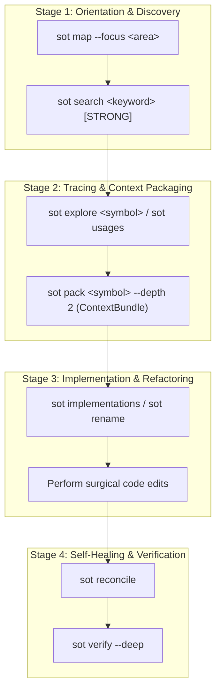

# SOT-Graph Agent Workflow & Operational Guidelines

> **Standard Operating Procedures (SOP) and Behavioral Protocols for AI Coding Agents utilizing `sot-graph` as a Verified Single Source of Truth (SSOT) Knowledge Layer.**

---

## 📑 Table of Contents

1. [Overview & Core Philosophy](#1-overview--core-philosophy)
2. [SOT-Graph 4-Stage Agent Operational Protocol](#2-sot-graph-4-stage-agent-operational-protocol)
   - [Stage 1: Orientation & Discovery](#stage-1-orientation--discovery)
   - [Stage 2: Dependency Tracing & Context Packaging](#stage-2-dependency-tracing--context-packaging)
   - [Stage 3: Safe Implementation & Refactoring](#stage-3-safe-implementation--refactoring)
   - [Stage 4: Self-Healing & Drift Verification](#stage-4-self-healing--drift-verification)
3. [Practical Walkthrough: 5-Step Task Impact Scoping](#3-practical-walkthrough-5-step-task-impact-scoping)
4. [Comprehensive Command & Tool Reference](#4-comprehensive-command--tool-reference)
5. [Multi-Harness Configuration Directives](#5-multi-harness-configuration-directives)
   - [Oh My Pi (OMP) Rules & Skills](#oh-my-pi-omp-rules--skills)
   - [Claude Code & Cursor MCP Directives](#claude-code--cursor-mcp-directives)
6. [Best Practices & Anti-Patterns](#6-best-practices--anti-patterns)

---

## 1. Overview & Core Philosophy

Autonomous AI coding agents operating across multi-thousand-line codebases often fail due to three primary failure modes:
1. **Path & Symbol Hallucinations ("Phantom Anchors"):** Generating edits or referencing files and functions that no longer exist or have been moved.
2. **Context Window Exhaustion:** Ingesting dozens of raw source files sequentially (>100 lines each) to discover relationships, wasting thousands of input tokens.
3. **Refactoring Blind Spots:** Modifying a core symbol without auditing upstream callers, causing subtle cross-module breakage.

`sot-graph` addresses these challenges by establishing the **Physical Filesystem as the Absolute Ground Truth**, mapped through an embedded, zero-daemon SQLite storage layer with sub-millisecond retrieval, deterministic AST parsing across 12+ languages, and a real-time **Trust Verdict Engine**.

### The Trust Verdict Hierarchy

Before returning any search or discovery result, `sot-graph` physically audits candidate nodes against disk:

| Verdict | Definition | Agent Action Required |
| :--- | :--- | :--- |
| `[STRONG]` | File exists on disk, symbol exists in AST, token coverage verified. | **Proceed directly.** 100% reliable anchor. |
| `[WEAK]` | Semantic or partial match; low lexical coverage. | **Inspect snippet range** before relying on symbol. |
| `[REBUILT]` | File moved or renamed; auto-rehomed by reconciler. | **Use updated path** reported in result. |
| `[REMOVED]` | Node deleted on disk; scheduled for purge. | **Do NOT use.** Symbol no longer exists. |
| `[NOPATH]` | Virtual or inline node without a physical file backing. | **Context-only.** Verify origin. |

---

## 2. SOT-Graph 4-Stage Agent Operational Protocol

All autonomous agents MUST follow this four-stage execution cycle:



---

### Stage 1: Orientation & Discovery

*Goal: Understand repository structure without dumping raw files into context.*

1. **Top-Down Repository Mapping:**
   Run PageRank-based repository mapping to identify top architectural landmark symbols:
   ```bash
   sot map --focus "auth,billing" --tokens 2000
   ```
2. **Ground Truth Symbol Search:**
   Search for targeted classes, methods, or database models:
   ```bash
   sot search "PaymentProcessor" -n 5
   # Or hybrid search with vector embeddings (if configured)
   sot search "handle stripe webhook refund" --hybrid
   ```
3. **Verification Invariant:** Check for `[STRONG]` verdict before using any file path.

---

### Stage 2: Dependency Tracing & Context Packaging

*Goal: Understand caller/callee relationships and pack relevant subgraphs to minimize token consumption.*

1. **Call Graph & Blast Radius Audit:**
   Inspect incoming callers and outbound dependencies:
   ```bash
   sot explore "PaymentProcessor.charge" --depth 2
   ```
2. **Call-Site Precision Audit:**
   Locate exact line-anchored locations where the target symbol is invoked:
   ```bash
   sot usages "PaymentProcessor.charge"
   ```
3. **k-Hop Subgraph Packaging (`sot pack`):**
   Extract a self-contained, token-efficient YAML context bundle (saves ~70% context tokens compared to reading raw files):
   ```bash
   sot pack "PaymentProcessor" --depth 2 --output .sot/bundle/payment_context.yaml
   ```

---

### Stage 3: Safe Implementation & Refactoring

*Goal: Execute code modifications with complete visibility of contracts and implementations.*

1. **Polymorphic & Interface Tracking:**
   When working with abstract classes or interfaces, discover all concrete implementations across modules:
   ```bash
   sot implementations "IPaymentGateway"
   ```
2. **Safe Multi-File Symbol Renaming:**
   Simulate or apply structural renames across all reference sites:
   ```bash
   # Preview mode (dry-run)
   sot rename "oldMethodName" "newMethodName" --dry-run
   
   # Execute rename across codebase
   sot rename "oldMethodName" "newMethodName" --apply
   ```
3. **Surgical Edits:** Apply edits only to the specific line ranges identified by SOT AST nodes.

---

### Stage 4: Self-Healing & Drift Verification

*Goal: Re-synchronize the knowledge graph with disk changes and guarantee zero drift.*

1. **Incremental Database Reconciliation:**
   After creating, modifying, or deleting files, synchronize the knowledge graph:
   ```bash
   sot reconcile --workers 4
   ```
2. **Drift Audit:**
   Verify that no phantom anchors or dangling edges exist:
   ```bash
   sot verify --deep
   ```
3. **Knowledge Retention (ADR):**
   Record non-obvious architecture decisions or tricky bug solutions for future sessions:
   ```bash
   sot insert --title "Postpaid Limit Check Bypass via BCCS Secondary DataSource" \
              --body "When subscriber is postpaid, route credit limit checks to BCCS Secondary DataSource instead of local Ledger DB." \
              --keywords "bccs,postpaid,credit-limit,datasource"
   ```

---

## 3. Practical Walkthrough: 5-Step Task Impact Scoping

When assigned an enterprise task (e.g., *UNPAY-1: Postpaid subscriber limit check via BCCS & LaoID Webhook API*), follow this standard 5-step analysis pattern:

```
  [1. SOT Reconcile & Search] ──────► Locate file/symbol with [STRONG] Trust Verdict
              │
  [2. Git Impact Scoping]     ──────► Filter Commits & Diffs by Ticket & Symbol
              │
  [3. SOT Explore & Pack]     ──────► Extract Call Graph, Inbound/Outbound, Datasources
              │
  [4. Workflow Reconstruction]──────► Synthesize Mermaid Sequence Diagrams
              │
  [5. SOT Bundle Synthesis]   ──────► Generate 5 Fact Bundles for Documentation
```

### Step 1: Physical Grounding with `sot search`
```bash
sot reconcile && sot search "MobileBalanceServiceImpl" && sot search "postpaid_subscriber"
```
*Output yields exact physical file paths, line anchors, and Trust Verdicts.*

### Step 2: Historical Git Scoping
```bash
git log --grep="UNPAY-1" --stat --name-only
git log -S "postpaid_subscriber" --oneline
```
*Identifies specific commits, authors, and modified files associated with the task.*

### Step 3: Architectural Call Graph Exploration
```bash
sot explore "MobileBalanceServiceImpl"
sot explore "LaoIdWebhookController"
sot pack "MobileBalanceServiceImpl" --depth 2 --output .sot/bundle/task_unpay1_bundle.yaml
```
*Extracts secondary datasources (BCCS) and caller pipelines.*

### Step 4: Workflow Reconstruction
Agents translate AST state transitions into Mermaid sequence diagrams for solution proposals.

### Step 5: Fact Bundle Generation for Solution Documents
```bash
sot bundle --module "unipay-service" --out .sot/bundle/
```
*Generates the 5 dense fact bundle files:*
1. `01_module_inventory.md`: Inventory of controllers, services, repositories.
2. `02_routing_endpoints.md`: REST endpoints and Webhook definitions.
3. `03_workflows_states.md`: State machines and conditional branches.
4. `04_dependencies_violations.md`: Dependency injection and secondary datasources.
5. `05_system_metrics.json`: Node/edge complexity counts and cohesion scores.

---

## 4. Comprehensive Command & Tool Reference

| Category | CLI Command | Native MCP Tool | Purpose |
| :--- | :--- | :--- | :--- |
| **Discovery** | `sot search "<query>" [-n 5] [--hybrid]` | `sot_search` | BM25 FTS5 + Hybrid vector search with Trust Verdicts. |
| **Orientation** | `sot map [--focus <areas>] [--tokens 2000]` | `sot_map` | PageRank-weighted architectural repo map. |
| **Call Graph** | `sot explore "<symbol>" [--depth 2]` | `sot_explore` | 2-way incoming callers and outgoing dependencies. |
| **Call-Sites** | `sot usages "<symbol>"` | `sot_usages` | Exact line-anchored invocations across codebase. |
| **Polymorphism**| `sot implementations "<interface>"` | `sot_implementations` | Concrete classes implementing an interface/trait. |
| **Refactoring** | `sot rename "<old>" "<new>" [--apply]` | — | Structural symbol renaming across all call-sites. |
| **Packaging** | `sot pack "<symbol>" [--depth 2] [--output <f>]`| `sot_pack` | Extracts k-hop subgraph into token-efficient YAML context. |
| **Fact Bundle** | `sot bundle [--module <m>] [--out <dir>]` | `sot_bundle` | Generates 5 fact markdown/json bundle files for reports. |
| **Communities** | `sot cluster [--scope <path>]` | `sot_communities` | Louvain / Label Propagation modularity analysis. |
| **Diagnostics** | `sot report [--out <path>]` | `sot_architecture_report`| Detects God Nodes, 2-hop Blast Radius, and violations. |
| **Visualizer** | `sot viz [--port 8000]` | — | Interactive standalone HTML force-directed graph. |
| **Export** | `sot export --format <obsidian\|graphrag\|scip>` | — | Exports graph to Obsidian Vault, GraphRAG JSON, or SCIP. |
| **Sync** | `sot reconcile [--workers 4] [--force]` | `sot_reconcile` | Incremental AST sync with SHA-256 dirty checking. |
| **Drift Audit** | `sot verify [--deep]` | `sot_verify_drift` | Audits physical existence and detects phantom nodes. |
| **Knowledge** | `sot insert --title "..." --body "..."` | `sot_notes` | Persists Architecture Decision Records into SQLite. |
| **Vector** | `sot embed [--model <m>]` | — | Indexes node contents into `sqlite-vec` virtual table. |
| **Health** | `sot doctor` | `sot_doctor` | SQLite page count, freelist, journal mode, and stats. |
| **Clean** | `sot clean [--reset] [--include-notes]` | — | Purges stale records and deleted file nodes. |
| **Vacuum** | `sot vacuum [--analyze]` | — | Reclaims unallocated SQLite freelist pages. |
| **Provision** | `sot setup [--harness omp\|claude\|all]` | — | Installs skills, rules, and MCP configurations. |

---

## 5. Multi-Harness Configuration Directives

### Oh My Pi (OMP) Rules & Skills

Install configurations via `sot setup --harness omp`.

Add the following invariants into `~/.omp/rules/sot-graph.md`:

```markdown
# SOT-Graph Project Rules for OMP (Oh My Pi)

1. Filesystem as Single Source of Truth (SSOT):
   The physical filesystem is absolute truth. Always ground symbol existence via `sot search` or `sot_search`.
2. Pre-Implementation Knowledge Reuse:
   Before writing any new utility, search for `[STRONG]` implementations.
3. Architectural Blast Radius Tracing:
   Before refactoring core functions/classes, run `sot explore "<symbol>"` or `sot usages "<symbol>"`.
4. Subgraph Context Packing:
   When modifying multi-module features, generate a context bundle with `sot pack` instead of reading dozens of raw files.
5. Self-Healing & Drift Reconciliation:
   After creating, moving, or deleting files, run `sot reconcile` and `sot verify`.
```

### Claude Code & Cursor MCP Directives

Configure MCP in `~/.claude/mcp.json` or `.cursor/mcp.json`:

```json
{
  "mcpServers": {
    "sot-graph": {
      "command": "sot",
      "args": ["mcp"],
      "env": {}
    }
  }
}
```

---

## 6. Best Practices & Anti-Patterns

### ❌ Anti-Patterns to Avoid
1. **Sequential Raw File Ingestion:** DO NOT sequentially read 10+ raw files (>100 lines) with generic file read tools. Use `sot map` -> `sot search` -> `sot pack`.
2. **Text Grep for Symbol Navigation:** DO NOT rely solely on regex grep for symbol renames or references. Grep misses aliased imports and matches dead comments. Use `sot usages` and `sot rename`.
3. **Blind Assumptions on Renamed Files:** DO NOT assume a file path exists based on historical prompt memory. Verify with `sot verify` or `sot search`.

### ✅ Best Practices
1. **Always Check Trust Verdicts:** Prioritize `[STRONG]` results; inspect `[WEAK]` results; update paths for `[REBUILT]`.
2. **Pack Before Slicing:** Extract subgraphs via `sot pack` when delegating tasks to worker subagents.
3. **Reconcile on Exit:** Always run `sot reconcile` after completing code generation to ensure the next session inherits a clean, synchronized state.
