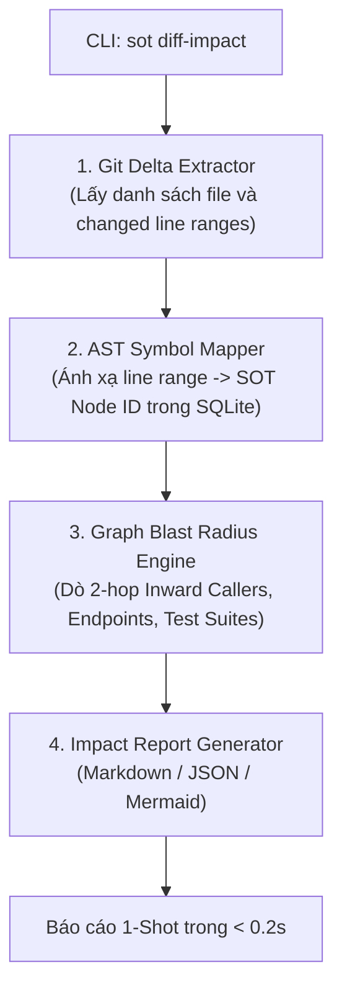

# TÀI LIỆU YÊU CẦU TÍNH NĂNG: SOT DIFF-IMPACT
## Bối Cảnh, Đánh Giá Rủi Ro & Giải Pháp Kỹ Thuật (Feature Handover Specification)

**Mã tính năng:** `SOT-FEAT-DIFF-IMPACT`  
**Dự án mục tiêu:** `sot-graph` (Verified Knowledge Graph for AI Coding Agents)  
**Ngày lập:** 24/08/2026  
**Người đề xuất:** OMP Harness & Architecture Team  

---

## 1. BỐI CẢNH & VẤN ĐỀ CẦN GIẢI QUYẾT (PROBLEM STATEMENT)

### 1.1. Thực trạng khi AI Agent phân tích tác động Commit / Branch
Khi lập trình viên hoặc AI Agent (OMP / OpenCode / Claude Code) được yêu cầu: *"Phân tích các commit trong 30 ngày qua tác động đến luồng nào?"* hoặc *"Đánh giá phạm vi ảnh hưởng (Blast Radius) của Pull Request này"*, quy trình hiện tại diễn ra như sau:
1. **Bước 1:** AI Agent phải tự chạy các lệnh Git bên ngoài (`git log`, `git show --stat`, `git diff`).
2. **Bước 2:** AI Agent đọc danh sách file thay đổi vào context LLM.
3. **Bước 3:** AI Agent gọi tuần tự nhiều lần các lệnh `sot explore <symbol>` hoặc `sot usages <symbol>` cho từng class/method.
4. **Bước 4:** AI Agent đọc file `02_routing_endpoints.md` để tự suy luận xem endpoint nào bị ảnh hưởng.

### 1.2. Nhược điểm của quy trình hiện tại
- **Tốn token & Độ trễ cao:** Phải mất từ 3 đến 5 lượt gọi công cụ (tool turns), tiêu tốn từ 10,000 đến 30,000 tokens chỉ để truyền tải raw diff và danh sách file.
- **Phụ thuộc vào suy luận LLM:** Việc liên kết từ dòng code bị sửa sang luồng nghiệp vụ bị phụ thuộc vào mức độ tập trung của mô hình AI, dễ bỏ sót các hàm gọi gián tiếp (Transitive Callers).

---

## 2. PHÂN TÍCH ĐÁNH ĐỔI & RỦI RO KIẾN TRÚC (ARCHITECTURAL TRADE-OFFS)

Khi tích hợp dữ liệu Git vào SOT-Graph, đội ngũ kỹ thuật đã đánh giá 2 hướng tiếp cận:

```
[HƯỚNG 1: TIGHT COUPLING - Lưu Git History vào SQLite] ➔ BỊ TỪ CHỐI
   ❌ Làm chậm tốc độ index: sot reconcile từ 4.7s sẽ tăng lên 1-2 phút do chạy git blame.
   ❌ Phình to database: Kích thước .sot/sot.db tăng từ 14MB lên hàng trăm MB.
   ❌ Lệch pha dữ liệu (Drift): Khi chuyển branch, dữ liệu git cũ trở thành dữ liệu rác.

[HƯỚNG 2: HYBRID ON-DEMAND - Tính toán Động tại thời điểm yêu cầu] ➔ ĐƯỢC CHỌN
   ✅ SOT-Graph SQLite giữ nguyên: Chỉ lưu AST, Call Graph và trạng thái đĩa hiện tại (Filesystem Reality).
   ✅ Git Engine chạy On-Demand: Chỉ đọc diff khi có yêu cầu phân tích commit/branch cụ thể.
   ✅ In-Memory Join: Tính toán giao điểm giữa Git Diff và SOT Node ID trong bộ nhớ RAM, tốc độ < 0.2s.
```

---

## 3. GIẢI PHÁP KỸ THUẬT: TÍNH NĂNG `sot diff-impact`

Xây dựng subcommand mới trong CLI `sot` với tên gọi **`sot diff-impact`**, đóng vai trò cầu nối thông minh giữa Git Diff và Đồ thị tri thức SOT-Graph.

### 3.1. Sơ đồ Kiến trúc Luồng Xử lý



---

### 3.2. Đặc tả Giao diện Dòng lệnh (CLI Specification)

```bash
# 1. Phân tích 1 commit cụ thể:
sot diff-impact 61ef3e4

# 2. Phân tích so sánh giữa 2 nhánh (phục vụ Review PR):
sot diff-impact main...001-apps-management

# 3. Phân tích các thay đổi chưa commit trong working directory:
sot diff-impact --staged
sot diff-impact --working-tree

# 4. Tùy chọn tham số:
#   --depth <1|2|3>       : Độ sâu truy vết lan truyền (Mặc định: 2)
#   --json                : Xuất dữ liệu cấu trúc JSON cho Tool Agent
#   -o, --output <path>   : Xuất báo cáo ra file markdown
```

---

### 3.3. Thuật toán Xử lý Chi tiết (Step-by-Step Algorithm)

#### Bước 1: Trích xuất Delta từ Git (Git Delta Extraction)
- Sử dụng thư viện Git tốc độ cao (ví dụ `pygit2` hoặc subprocess gọi `git diff -U0 <target>`).
- Thu thập danh sách các khối thay đổi dạng:
  ```json
  [
    {
      "file": "src/Admin.Application/AppManagement/AppRoleAppService.cs",
      "modified_lines": [[48, 65], [113, 140]]
    }
  ]
  ```

#### Bước 2: Ánh xạ Dòng thay đổi sang Node AST (AST Coordinate Mapping)
- Truy vấn bảng `nodes` trong SQLite `.sot/sot.db` để tìm các Symbol (Class, Method, Property) có tọa độ `line_start <= modified_line <= line_end`.
- Kết quả thu được: Danh sách các `Directly Impacted Node IDs`.

#### Bước 3: Dò Bán kính Tác động Đồ thị (Graph Traversal)
- **Truy vết Tầng Gọi (Inward Callers):** Dò theo các cạnh `calls`, `extends`, `implements` ngược chiều từ độ sâu 1 đến N để tìm tất cả các Service/Controller bị ảnh hưởng.
- **Truy vết Cổng API (HTTP Routes):** Đối chiếu các Node bị ảnh hưởng với bảng định tuyến để xác định các REST API Endpoints bị tác động.
- **Truy vết Bộ Kiểm thử (Test Impact):** Tìm tất cả các file test trong thư mục `test/` có quan hệ gọi tới các Node bị thay đổi để đề xuất danh sách test cần chạy lại.

#### Bước 4: Đóng gói Báo cáo (Report Generation)
Xuất ra định dạng Markdown bảng tổng hợp trực quan và JSON Schema chuẩn.

---

### 3.4. Cấu trúc Báo cáo Đầu ra (Output Markdown Sample)

```markdown
# SOT-Graph Impact Analysis: Commit 61ef3e4

## 1. Summary
- **Target:** `61ef3e4` (anhnt - 10/08/2026)
- **Directly Modified Files:** 92 files
- **Directly Impacted Symbols:** 48 symbols
- **Transitive Blast Radius:** 112 downstream symbols (Depth: 2)

## 2. Affected HTTP API Endpoints
| HTTP Method | Route | Handler / Controller | Risk Level |
| :---: | :--- | :--- | :---: |
| `POST` | `/api/app-management/roles` | `AppManagementController.CreateRoleAsync` | HIGH |
| `GET` | `/api/app-management/tenant-members/effective-permissions` | `AppManagementController.GetTenantMemberEffectivePermissionsAsync` | CRITICAL |

## 3. Downstream Service Impact (2-Hop Call Graph)
- `AppRoleAppService` → `TenantMemberAssignmentAppService` → `UserPermissionChecker`

## 4. Recommended Test Suites to Run
- `test/Admin.Application.Tests/TenantMember/MultiTenantAppAuthE2ETests.cs`
- `test/Admin.Application.Tests/TenantMember/UserPermissionCheckerTests.cs`
```

---

## 4. TÍCH HỢP CHO AI AGENT (AGENT TOOL / MCP DEVICE)

Bổ sung thiết bị công cụ mới vào bộ công cụ SOT-Graph (`xd://sot_diff_impact`):

### JSON Schema cho Agent:
```json
{
  "name": "sot_diff_impact",
  "description": "Analyze the architectural blast radius and affected flows of a git commit, PR, or branch comparison in 1 shot.",
  "parameters": {
    "type": "object",
    "properties": {
      "target": {
        "type": "string",
        "description": "Commit hash, branch name, or git diff range (e.g. 'main...feature')"
      },
      "depth": {
        "type": "integer",
        "description": "Traversal depth for transitive callers (default: 2)",
        "default": 2
      }
    },
    "required": ["target"]
  }
}
```

---

## 5. TIÊU CHÍ NGHIỆM THU (ACCEPTANCE CRITERIA)

1. **Hiệu năng (Performance):** Lệnh `sot diff-impact <commit>` phải hoàn thành trong thời gian **dưới 0.5 giây** đối với commit có quy mô dưới 100 files.
2. **Không làm bẩn CSDL (Zero DB Side-Effects):** Chạy lệnh `sot diff-impact` hoàn toàn ở chế độ Read-Only, không làm thay đổi hay ghi thêm bản ghi rác vào `.sot/sot.db`.
3. **Độ chính xác (Accuracy):** Xác định đúng 100% các Controller và Service trực tiếp chứa các hàm bị sửa đổi trong commit.
4. **Pure Markdown Output:** Báo cáo đầu ra sử dụng 100% ký tự Unicode chuẩn, không chứa ký hiệu LaTeX để tương thích hoàn toàn với mọi trình đọc markdown.
