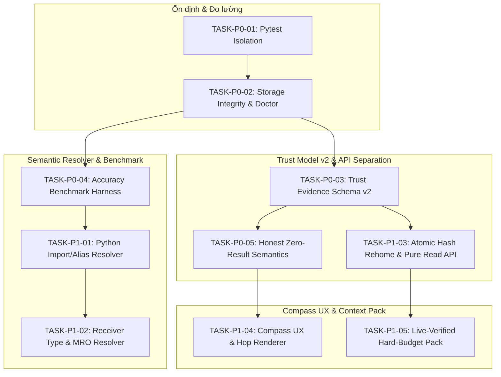

# SOT-Graph — Kế hoạch Triển khai Chi tiết (Phased Execution Plan)

**Baseline:** commit `870f27f7333724318bab8fd69ce265bf0e63b60e`, phiên bản `0.1.0`  
**Tài liệu gốc:** `plan/sot-graph-roadmap.md`  
**Ngày phê duyệt:** 2026-08-23

---

## 1. Tổng quan Phân kỳ Triển khai (Roadmap Overview)

---

## 2. Chi tiết Các Giai đoạn Thực thi

### SPRINT 1 (Phase 0): Test Isolation, Storage Integrity & Doctor

#### TASK-P0-01: Cô lập Pytest Configuration & Chuẩn hóa Benchmark Script
- **Phạm vi tác động:** `pyproject.toml`, `pytest.ini`, `scripts/test_real_repos.py`.
- **Mục tiêu:**
  1. Thêm cấu hình pytest vào `pyproject.toml` (hoặc `pytest.ini`), chỉ định `testpaths = ["tests"]`, loại trừ `scripts`, `.sot`, `build`, `dist`.
  2. Refactor `scripts/test_real_repos.py`: Bỏ các đường dẫn máy cá nhân cứng (`/Users/...`), đọc qua tham số CLI hoặc biến môi trường `SOT_BENCHMARK_REPOS_DIR`. Đổi tên hoặc cấu hình để pytest không auto-collect.
- **Tiêu chí nghiệm thu:** `pytest -q` từ root pass 100% test trên checkout sạch, không collect benchmark scripts.

#### TASK-P0-02: Storage Integrity, PRAGMA Checks & `sot doctor` Upgrade
- **Phạm vi tác động:** `src/sot_graph/db.py`, `src/sot_graph/cli.py`, `tests/test_storage_integrity.py`.
- **Mục tiêu:**
  1. Bổ sung `Database.integrity_check() -> Dict[str, Any]` trong `db.py`: chạy `PRAGMA quick_check`, `PRAGMA foreign_key_check`, kiểm tra orphan nodes/edges và thống kê pending edges.
  2. Nâng cấp `sot doctor` (`cli.py`): In bảng báo cáo chi tiết SQLite health (WAL mode, page stats, quick_check, journal count, lock status, pending edge reasons) và hỗ trợ flag `--json`.
  3. Viết `tests/test_storage_integrity.py`: Kiểm thử stress 100 vòng (create/reconcile/read/crash simulation) với verify `quick_check == 'ok'`.
- **Tiêu chí nghiệm thu:** `pytest tests/test_storage_integrity.py` pass; `sot doctor` hiển thị đúng thông số kỹ thuật thực tế.

---

### SPRINT 2 (Phase 1): Trust Model v2 & Pure Read API

#### TASK-P0-03: Trust Evidence Schema v2
- **Phạm vi tác động:** `src/sot_graph/evidence.py`, `src/sot_graph/verifier.py`, `src/sot_graph/mcp_service.py`, `src/sot_graph/cli.py`.
- **Mục tiêu:** Tách biệt 5 chiều: `freshness`, `relevance`, `resolution`, `completeness`, `confidence`. Bỏ phụ thuộc vào chuỗi enum thô `[STRONG]`/`[WEAK]`.

#### TASK-P1-03: Pure Read API & Atomic Hash Rehome
- **Phạm vi tác động:** `src/sot_graph/verifier.py`, `src/sot_graph/cli.py`, `src/sot_graph/db.py`, `src/sot_graph/reconciler.py`.
- **Mục tiêu:** Xóa bỏ triệt để silent auto-purge/rehome trong `cmd_search`. Thao tác tìm kiếm là pure read. Rehome file atomically trong 01 SQLite transaction dựa trên content hash sha256.

#### TASK-P0-05: Honest Zero-Result Semantics
- **Phạm vi tác động:** `src/sot_graph/db.py`, `src/sot_graph/cli.py`, `src/sot_graph/mcp_service.py`.
- **Mục tiêu:** `sot usages` không trả về "No usages found" nếu còn candidate trong `pending_edges`; trả về `PARTIAL` kèm danh sách unresolved candidates và bước kiểm tra tiếp theo.

---

### SPRINT 3 (Phase 2): Semantic Resolver & Accuracy Benchmark

#### TASK-P0-04: Accuracy Benchmark Harness
- **Phạm vi tác động:** `tests/benchmark/`, `scripts/benchmark_accuracy.py`.
- **Mục tiêu:** Bộ ground truth corpus chuẩn hóa và harness đo lường Precision / Recall / F1 cho call edges.

#### TASK-P1-01: Python Import & Alias Resolver
- **Phạm vi tác động:** `src/sot_graph/_vendor/graphify/extract.py`, `src/sot_graph/extractor.py`, `src/sot_graph/db.py`.
- **Mục tiêu:** Xử lý multi-level relative imports, alias mappings, và `__all__` re-exports xuyên file.

#### TASK-P1-02: Receiver Type & MRO Resolver
- **Phạm vi tác động:** `src/sot_graph/_vendor/graphify/extract.py`, `src/sot_graph/db.py`.
- **Mục tiêu:** Type inference cho receiver method (`self.method()`, instance types) và duyệt kế thừa MRO khi class con không override method.

---

### SPRINT 4 (Phase 3): Compass UX & Context Pack

#### TASK-P1-04: Compass UX & Hop Renderer
- **Phạm vi tác động:** `src/sot_graph/cli.py`, `src/sot_graph/db.py`.
- **Mục tiêu:** `sot explore` thể hiện chính xác khoảng cách hop (1-hop direct vs 2-hop transitive), collapse hubs lớn.

#### TASK-P1-05: Live-Verified Hard-Budget Context Pack
- **Phạm vi tác động:** `src/sot_graph/pack.py`, `src/sot_graph/repo_map.py`.
- **Mục tiêu:** Live verification 100% neighbors trên đĩa; tokenizer adapter đảm bảo sai số token $\le 5\%$.

---

## 3. Ma trận Phụ thuộc & Tiến độ Triển khai

| Mã Task | Tên Task | Phụ thuộc | Sprint | Trọng tâm kiểm định |
|---|---|---|---|---|
| `TASK-P0-01` | Pytest Isolation & Benchmark Config | Không | Sprint 1 | `pytest -q` pass trên checkout sạch |
| `TASK-P0-02` | Storage Integrity, PRAGMA Checks & Doctor | `TASK-P0-01` | Sprint 1 | Stress test 100 rounds `quick_check=ok` |
| `TASK-P0-03` | Trust Evidence Schema v2 | `TASK-P0-02` | Sprint 2 | 5 chiều evidence độc lập |
| `TASK-P1-03` | Pure Read API & Atomic Hash Rehome | `TASK-P0-03` | Sprint 2 | Zero silent mutation khi search |
| `TASK-P0-05` | Honest Zero-Result Semantics | `TASK-P0-03` | Sprint 2 | Khai báo đúng số pending edges |
| `TASK-P0-04` | Accuracy Benchmark Harness | `TASK-P0-02` | Sprint 3 | Có bộ baseline Precision/Recall |
| `TASK-P1-01` | Python Import/Alias Resolver | `TASK-P0-04` | Sprint 3 | Re-export & relative import passed |
| `TASK-P1-02` | Receiver Type & MRO Resolver | `TASK-P1-01` | Sprint 3 | Precision $\ge 95\%$, Recall $\ge 80\%$ |
| `TASK-P1-04` | Compass UX & Hop Renderer | `TASK-P0-05` | Sprint 4 | Depth 2 không bị flatten |
| `TASK-P1-05` | Live-Verified Hard-Budget Pack | `TASK-P1-03` | Sprint 4 | Sai số token $\le 5\%$, live-verified |
