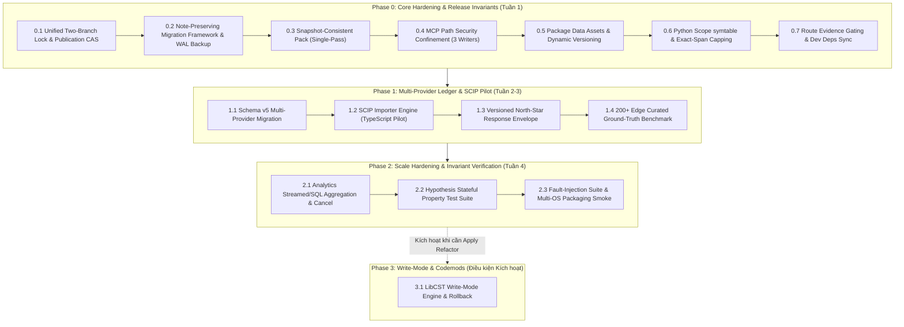

# Lộ trình Tối ưu hóa & Tích hợp Mã nguồn mở Toàn diện cho SOT-Graph (v2.0)

**Tài liệu Kế hoạch Kỹ thuật & Báo cáo Đánh giá Kiến trúc Độc lập**  
**Repo:** `minhgv/sot-graph`  
**Trạng thái Codebase:** Schema SQLite v4, WAL + FTS5, 10 Tree-sitter Grammars, 17 MCP Tools, Batch Reconciler, Watcher, Vector/RRF, SCIP Exporter  
**Mục tiêu cốt lõi:** Đảm bảo tính nhất quán Single Source of Truth (SSOT), loại bỏ hoàn toàn các lỗ hổng stale-data / race condition, bảo toàn 100% ghi chú người dùng qua migration, chuẩn hóa bảo mật MCP, nâng cao độ chính xác AST Call-Graph/Route Extraction, và thiết lập pipeline tích hợp SCIP Provider cùng bộ đo kiểm Invariant (Hypothesis).

---

## 1. Tóm tắt Quyết định & Khung Chiến lược Đã Hiệu chỉnh

Sau khi Advisor Reviewer & Advisor Verifier tiến hành đối chiếu toàn diện giữa kế hoạch lý thuyết và mã nguồn thực tế trong `src/sot_graph/`, các kết luận kỹ thuật cốt lõi được xác lập như sau:

1. **Không bổ sung bừa bãi các analyzer runtime / daemon nặng:** 
   - Không tích hợp LSP daemon live (gây phá vỡ kiến trúc zero-daemon, tốn RAM/process management).
   - Không tích hợp LibCST ở chế độ read-only (chỉ tích hợp khi mở tính năng write-mode/AST rewrite ở Phase 3).
   - Không tích hợp ast-grep, Joern, OpenGrep cho nhu cầu code navigation cơ bản.
2. **Khóa chặt 7 Invariant Kiến trúc Trọng yếu (Release-Blocking):**
   - **Persistence:** Lưu trữ multi-provider evidence độc lập trước khi chạy SCIP importer.
   - **Migration An toàn & WAL-Consistent Backup:** Không DROP toàn bộ bảng khi nâng cấp schema; sao lưu bằng SQLite Online Backup API (`sqlite3.Connection.backup`) dưới project lock; bảo toàn 100% `graph_notes` và tri thức thủ công của người dùng qua nâng cấp schema v4 -> v5.
   - **Publication Concurrency:** Thực hiện CAS disk hash & stat validation bên trong `_publication_gate()` để triệt tiêu cửa sổ stale commit.
   - **Mutation Gateway Hai Nhánh (Two-Branch Mutation Gateway):**
     * Nhánh giao dịch (Transactional: `reconcile`, `insert note`, `clean`, `embed`, `cluster`, `report`, `migrate`): Bắt buộc đi qua thứ tự `Project Lock -> BEGIN IMMEDIATE -> Mutate -> Commit -> Release Lock`.
     * Nhánh bảo trì (Maintenance: `vacuum`): Bắt buộc đi qua thứ tự `Project Lock -> Check No Active Tx -> WAL Checkpoint -> VACUUM -> Release Lock`.
     * Giữ nguyên inode ổn định của lock file (không bao giờ xoá unlink file lock để tránh race condition trên multi-process).
   - **Snapshot-Consistent Pack:** Sinh context pack với cơ chế single-pass read-hash-slice và single SQLite transaction, fail-closed với mã `STALE_SNAPSHOT` nếu disk thay đổi.
   - **MCP Security Confinement:** Bắt buộc giới hạn cả 3 API ghi file (`get_architecture_bundle`, `solution_inventory`, `solution_bundle`) qua một hàm chuẩn hóa `resolve_and_validate_output_path(project_root, user_path)` với `realpath` / `commonpath`, triệt tiêu path traversal và nested symlinks.
   - **Packaging & Wheel Assets:** Đóng gói đầy đủ templates, adapter assets; đọc version động từ `importlib.metadata.version("sot-graph")` cho cả MCP Server (`server._sot_initialization_options.server_version`) và CLI `--version`.
3. **Hai tích hợp được phê duyệt có điều kiện:**
   - **SCIP Importer (Tùy chọn/Plugin runtime duy nhất):** Nhập definition/reference compiler-backed từ indexer bên ngoài vào ledger bằng chứng riêng biệt.
   - **Hypothesis (Dev-only dependency):** Stateful property-based testing để khóa không gian shadowing, multi-process concurrency và journal invariants.

---

## 2. Ma trận Hiện trạng Triển khai Thực tế (Code-Backed Status Matrix)

| Phân hệ / Thành phần | Trạng thái | Neo mã nguồn thực tế (`file:line`) | Điều kiện tiên quyết / Owner | Mức chặn phát hành (Release-Blocking) |
|---|---|---|---|:---:|
| **Python AST Extractor** | `Implemented` | `src/sot_graph/extractor.py:24-115` | Stdlib `ast` | Không |
| **Python Scope Resolver (`symtable`)** | `Missing` | `src/sot_graph/extractor.py:80-140` | Tách import map theo lexical scope | **P0 (Chặn)** |
| **Graphify Core Vendor** | `Implemented` | `src/sot_graph/_vendor/graphify/` | Không can thiệp core vendor | Không |
| **Tree-sitter Grammars (10 wheels)** | `Implemented` | `pyproject.toml:22-31` | Cài đặt đầy đủ qua wheels | Không |
| **Tree-sitter Production Bridge** | `Partial` | `src/sot_graph/ts_extract.py:27-110` | Bổ sung `provider_provenance` & capability ledger | **P0 (Chặn)** |
| **Fallback Exact Span Capping** | `Partial` | `src/sot_graph/verifier.py:90-145` | Cấm regex fallback trả `EXACT_SPAN` | **P0 (Chặn)** |
| **SQLite WAL + FTS5** | `Implemented` | `src/sot_graph/db.py:20-110` | SQLite engine nội tại | Không |
| **Schema Migration Framework & Note Safety** | `Missing` | `src/sot_graph/db.py:135-159, 849-930` | Xây dựng framework migration transactional + WAL backup | **P0 (Chặn)** |
| **Unified Mutation Gateway (All CLI Writers)** | `Missing` | `src/sot_graph/locking.py:1-78`, `src/sot_graph/cli.py:33, 90, 445, 457, 970, 1048` | Bọc toàn bộ writers (`clean`, `vacuum`, `embed`, `insert`, `report`, `cluster`) qua gateway | **P0 (Chặn)** |
| **Atomic CAS inside Publication Gate** | `Partial` | `src/sot_graph/reconciler.py:294-329`, `src/sot_graph/db.py:542-550` | Chuyển disk hash/stat vào bên trong `_publication_gate()` | **P0 (Chặn)** |
| **Snapshot-Consistent Pack** | `Partial` | `src/sot_graph/pack.py:130-330` | Atomic read-hash-slice + generation check | **P0 (Chặn)** |
| **MCP Server & Tool Suite (17 tools)** | `Implemented` | `src/sot_graph/mcp_server.py:1-400` | FastMCP / mcp SDK | Không |
| **MCP Root Confinement Security** | `Missing` | `src/sot_graph/mcp_server.py:209-237`, `src/sot_graph/mcp_service.py:619-643, 737-760, 778-797` | Canonical path check cho cả 3 hàm ghi bundle/inventory | **P0 (Chặn)** |
| **MCP Server & CLI Versioning** | `Outdated` | `src/sot_graph/mcp_server.py:386`, `src/sot_graph/cli.py:1188-1196` | Chuyển literal `0.1.0` sang `importlib.metadata.version` & thêm `sot --version` | **P0 (Chặn)** |
| **Package Data (Templates/Adapters)** | `Missing` | `src/sot_graph.egg-info/SOURCES.txt`, `src/sot_graph/adapters/omp.py:56-96` | Khai báo `package-data` trong `pyproject.toml` | **P0 (Chặn)** |
| **Route Extraction Evidence Gating** | `Partial` | `src/sot_graph/analytics/architecture.py:580-665`, `bundle.py:206-239` | AST decorator/registration evidence thay vì đoán tên | **P1** |
| **Analytics Bounded Scale & Cancel** | `Partial` | `src/sot_graph/analytics/graph.py:88-145, 276-286`, `mcp_service.py:801-805` | SQL degree aggregation + cooperative cancel | **P2** |
| **SCIP Exporter** | `Implemented` | `src/sot_graph/export/scip.py:1-200` | Protobuf serializer | Không |
| **SCIP Importer & Evidence Ledger (v5)** | `Missing` | `src/sot_graph/importer/scip.py` (chưa có) | Multi-provider schema + position translation | **P1** |
| **Dev Dependencies & Extras Declaration** | `Missing` | `pyproject.toml:1-83` | Khai báo `dev`, `tokens`, `scip`, giữ nguyên `all` grammars | **P0 (Chặn)** |
| **Curated Ground Truth Benchmark** | `Partial` | `tests/benchmark/test_benchmark_sot.py` | Mở rộng từ 6 ground-truth edges lên 200+ edges | **P1** |

---

## 3. Phân tích Chi tiết 13 Khoảng trống Kỹ thuật & Invariants Trọng yếu

### 3.1. Lưu trữ Bằng chứng Đa nguồn (Multi-Provider Evidence Ledger)
- **Vấn đề:** Hiện tại `src/sot_graph/extractor.py:205-241` xóa bỏ metadata của provider trong quá trình chuẩn hóa; bảng `graph_edges` trong `src/sot_graph/db.py:20-40` deduplicate theo `(path, src, dst, relation)` mà không có cột provider, run ID hay byte/character range. Khi cả Heuristic Tree-sitter và SCIP cùng đưa ra nhận định, dữ liệu bị gộp đè làm mất khả năng truy vết nguồn.
- **Giải pháp:** Thiết kế schema v5 bổ sung bảng `provider_runs` (lưu provider, version, arguments, snapshot_hash, root, position_encoding, created_at) và `provider_evidence` (lưu occurrence/relation thô kèm span). Bảng `graph_edges` và `graph_nodes` trở thành canonical projection được tổng hợp có trọng số trust.
- **Tiêu chuẩn nghiệm thu:** Hai claim cùng tọa độ từ 2 provider khác nhau phải tồn tại độc lập; import lỗi phải rollback sạch; không promotion dữ liệu từ stale run.

### 3.2. Bảo toàn Tri thức & Ghi chú Người dùng qua Nâng cấp Schema (Non-Destructive Migration & WAL Backup)
- **Vấn đề:** `src/sot_graph/db.py:135-159, 240-255` xử lý schema mismatch bằng cách thực thi `DROP TABLE` toàn bộ. Người dùng lưu trữ ghi chú thủ công qua `sot insert` (`src/sot_graph/cli.py:457`), được lưu vào `graph_nodes`. Khi nâng cấp schema, toàn bộ ghi chú này sẽ bị xóa sạch nếu không có cơ chế migration giao dịch. Ngoài ra, việc copy file thô khi đang chạy WAL mode có thể bỏ sót dữ liệu chưa checkpoint từ file `.sot.db-wal`.
- **Giải pháp:** 
  1. Trong Phase 0, xây dựng khung `_migrate_database()` an toàn: trước khi thực thi DDL, sử dụng SQLite Online Backup API (`sqlite3.Connection.backup`) dưới project lock để tạo bản sao lưu nhất quán `.sot/sot.db.bak`.
  2. Trong Phase 1, thực hiện bước nhảy version v4 -> v5 chính thức: tách bảng `user_notes` độc lập hoặc migrate node `kind == 'note'` an toàn sang cấu trúc mới, bảo đảm rollback tự động nếu migration lỗi.
- **Tiêu chuẩn nghiệm thu:** Test fixture với database v4 có sẵn notes; sau khi chạy migration, 100% user notes và vector embeddings liên quan còn nguyên vẹn; test giả lập migration lỗi tự động phục hồi nguyên trạng từ backup.

### 3.3. Xác thực Nội dung Tệp bên trong Cổng Công bố (Atomic Publication CAS Gate)
- **Vấn đề:** Trong `src/sot_graph/reconciler.py:294-329`, tiến trình thực hiện tính hash trước khi xin lock `_publication_gate()`. Nếu một tiến trình khác sửa đổi file trên đĩa trong khi tiến trình này đang chờ lock, nó sẽ công bố kết quả AST cũ kèm hash cũ, ghi đè trạng thái đĩa mới.
- **Giải pháp:** Chuyển thao tác kiểm tra stat/hash đĩa vào bên trong `_publication_gate()`. Re-stat và re-hash tệp ngay khi giữ lock; nếu hash trên đĩa khác với hash vừa parse, từ chối commit với mã `RECONCILE_CONFLICT` và kích hoạt re-parse.
- **Tiêu chuẩn nghiệm thu:** Test chạy 2 tiến trình đồng thời: tiến trình A giữ lock, tiến trình B chờ công bố; đĩa bị sửa đổi trong lúc B chờ; chứng minh B từ chối ghi và re-reconcile chính xác thế hệ đĩa mới.

### 3.4. Cổng Đột biến Cơ sở Dữ liệu Tập trung Hai Nhánh (Two-Branch Mutation Gateway)
- **Vấn đề:** `src/sot_graph/locking.py:1-10, 72-78` sử dụng file lock advisory trên inode ổn định. Nếu xóa file lock (unlink) khi tưởng nhầm là "orphaned", inode bị đổi khiến tiến trình khác lock file mới và tạo ra 2 writer đồng thời. Lệnh `sot vacuum` (`src/sot_graph/cli.py:90`, `src/sot_graph/db.py:980-1007`) không thể chạy bên trong `BEGIN IMMEDIATE` vì SQLite cấm VACUUM trong active transaction. Các lệnh ghi khác (`cmd_clean`, `cmd_embed`, `cmd_insert`, `cmd_report` với `save_communities=True`, `cmd_cluster`) chưa được bọc lock đầy đủ.
- **Giải pháp:**
  1. Giữ nguyên inode của lock file (không bao giờ unlink lock file; advisory lock tự giải phóng khi tiến trình kết thúc).
  2. Thiết kế Gateway 2 nhánh trong `Database`:
     - **Nhánh Transactional** (`clean`, `insert`, `embed`, `cluster`, `report`, `migrate`, `reconcile`): `Project Lock -> BEGIN IMMEDIATE -> Mutate -> Commit -> Release Lock`.
     - **Nhánh Maintenance** (`vacuum`): `Project Lock -> Ensure No Active Tx -> WAL Checkpoint (TRUNCATE) -> VACUUM -> Release Lock`.
- **Tiêu chuẩn nghiệm thu:** Chạy song song `reconcile`, `clean`, `insert`, `embed`, `report`, `vacuum` trong stress test 50 workers; không phát sinh deadlock, không lỗi `database is locked`, không corrupt inode.

### 3.5. Sinh Gói Ngữ cảnh Nhất quán Thế hệ Đĩa (Snapshot-Consistent Context Pack)
- **Vấn đề:** `src/sot_graph/pack.py:130-330` băm tệp đích trước, sau đó lại mở lại tệp để cắt source (`_slice_source`), đồng thời đọc đồ thị qua nhiều query SQLite không gom transaction. Nếu tệp bị sửa giữa lúc hash và slice, pack sẽ chứa code mới dưới SHA cũ kèm nhãn `[STRONG]` sai thực tế.
- **Giải pháp:** Thực hiện cơ chế Single-Pass: Đọc bytes tệp vào bộ nhớ đúng 1 lần duy nhất, từ mảng bytes đó tính SHA256 và cắt AST slice. Gom toàn bộ truy vấn đồ thị trong 1 SQLite Read Transaction (`BEGIN DEFERRED`), kiểm tra lại generation của tất cả tệp liên quan, fail-closed với mã `STALE_SNAPSHOT` nếu phát hiện drift.
- **Tiêu chuẩn nghiệm thu:** Regression test can thiệp sửa file giữa các bước slice; chứng minh pack phát hiện không đồng nhất và trả mã lỗi rõ ràng, không xuất hiện bundle lai tạp.

### 3.6. Giới hạn Phạm vi Ghi của MCP Server trong Thư mục Dự án (Path Confinement)
- **Vấn đề:** Cả 3 hàm ghi trong `src/sot_graph/mcp_service.py` gồm `get_architecture_bundle` (dòng 619-643), `solution_inventory` (dòng 737-760) và `solution_bundle` (dòng 778-797) chấp nhận tham số đường dẫn tệp do client truyền vào mà không kiểm tra ranh giới thư mục gốc.
- **Giải pháp:** Xây dựng hàm kiểm tra tập trung:
  ```python
  def resolve_and_validate_output_path(project_root: Path, target_path: str | Path) -> Path:
      root_real = project_root.resolve()
      resolved = (root_real / target_path).resolve()
      if os.path.commonpath([str(root_real), str(resolved)]) != str(root_real):
          raise PermissionError(f"Output path '{target_path}' escapes project root boundary.")
      return resolved
  ```
  Áp dụng hàm này cho toàn bộ 3 entrypoints ghi file trong `mcp_service.py`.
- **Tiêu chuẩn nghiệm thu:** Test gọi MCP tools với output path dạng `../../etc/passwd`, `/tmp/malicious.md`, và symlink trỏ ra ngoài; chứng minh hệ thống ném ngoại lệ `PermissionError` và từ chối ghi.

### 3.7. Đóng gói Tài nguyên Mẫu, Adapter & Đồng bộ Phiên bản Động
- **Vấn đề:** `src/sot_graph.egg-info/SOURCES.txt` bỏ sót các tệp non-Python (`templates/ARCHITECTURE_TEMPLATE.md`, `adapters/*.md`, `adapters/*.ts`). MCP server đang hardcode literal `server_version="0.1.0"` tại `src/sot_graph/mcp_server.py:386`, và `src/sot_graph/cli.py:1188-1196` thiếu tùy chọn toàn cục `--version`.
- **Giải pháp:** 
  1. Khai báo đầy đủ `[tool.setuptools.package-data]` trong `pyproject.toml` (bao gồm `templates/*`, `adapters/*.md`, `adapters/*.ts`), sử dụng `importlib.resources` để load tài nguyên trong `src/sot_graph/adapters/omp.py`.
  2. Sử dụng `importlib.metadata.version("sot-graph")` để khởi tạo `FastMCP` tại `mcp_server.py:386` (lưu trong `server._sot_initialization_options.server_version`).
  3. Thêm tùy chọn toàn cục `sot --version` trong `cli.py`.
- **Tiêu chuẩn nghiệm thu:** Build wheel (`uv build`), cài đặt vào venv sạch với `".[all,dev]"`, chạy `sot --version`, `sot setup --harness omp --workspace-only` và `sot bundle`; kiểm tra 100% template render thành công mà không có cảnh báo missing asset.

### 3.8. Giới hạn Tài nguyên & Cho phép Hủy Tác vụ Analytics (Bounded Scale & Cancellation)
- **Vấn đề:** `src/sot_graph/analytics/graph.py:88-145` nạp toàn bộ nodes (kèm thân hàm lớn) và edges vào RAM để dựng đồ thị NetworkX. Trên codebase 100k nodes, RAM có thể vượt hàng gigabytes. Hơn nữa, `mcp_service.py:801-805` dùng `wait_for(to_thread(...))` nên khi client timeout, worker thread trong background vẫn tiếp tục chạy ngốn 100% CPU.
- **Giải pháp:** Thực hiện chiếu trường (projection) hẹp: chỉ SELECT `(id, name, path, kind)` và `(src, dst, relation)`, không nạp `body`/`signature` khi tính toán đồ thị. Đẩy các phép tính bậc (degree, in-degree, God Node) trực tiếp xuống SQLite aggregation queries. Bổ sung cờ `threading.Event` hủy tác vụ hợp tác hoặc chạy trong process pool có thể terminate khi timeout.
- **Tiêu chuẩn nghiệm thu:** Benchmark với đồ thị giả lập 50k nodes / 200k edges; peak memory không vượt quá 250MB; tác vụ bị timeout dừng tiêu thụ CPU ngay lập tức.

### 3.9. Kiểm soát Bằng chứng Trích xuất Tuyến đường Web (Route Evidence Gating)
- **Vấn đề:** `src/sot_graph/analytics/architecture.py:580-665` hiện tại coi bất kỳ hàm nào nằm trong file có tên chứa `controller` / `router` là HTTP endpoint, tự bịa path/method dựa vào tên hàm (VD: `handle_auth` -> `POST /handle/auth`), gây sinh thông tin giả mạo (hallucinated facts) trong `02_routing_endpoints.md`.
- **Giải pháp:** Chỉ công nhận Endpoint khi có bằng chứng AST tường minh: `@app.get/post` (FastAPI/Flask), `@Get/@Post` (NestJS/Spring), `@route` (Odoo), Express `router.get/post`. Các hàm suy diễn heuristic bắt buộc đưa vào mục riêng `Heuristic Route Candidates` kèm độ tin cậy thấp (`confidence < 0.5`) và nhãn cảnh báo rõ ràng.
- **Tiêu chuẩn nghiệm thu:** Test suite với các ca Controller thuần logic (Flutter UI Controller, Kubernetes Operator Controller, Base Controller) không bị gán nhãn sai thành REST endpoint.

### 3.10. Chuẩn hóa Khung Phản hồi API Hướng Đích (North-Star Envelope Contract)
- **Vấn đề:** Các lệnh `sot usages`, `sot explore`, `sot pack` và MCP tools hiện trả về các định dạng JSON khác nhau. Trạng thái `status == "COMPLETE"` hiện được gán bừa khi bảng `pending_usages` rỗng, gây hiểu lầm là đồ thị đã bao quát 100% codebase kể cả dynamic runtime.
- **Giải pháp:** Chuẩn hóa một Versioned Response Envelope chung với trường định danh nhất quán `"providers"` cho toàn bộ CLI và MCP:
  ```json
  {
    "schema_version": "2.0.0",
    "snapshot_generation": 1042,
    "manifest_digest": "sha256:abcd1234...",
    "completeness": "COMPLETE_WITHIN_INDEX_CAPABILITY",
    "providers": [
      {"name": "tree-sitter-ts", "version": "0.26.0", "capability": "SYNTAX_CALL"},
      {"name": "scip-typescript", "version": "0.4.0", "capability": "TYPE_RESOLVED_REFERENCE"}
    ],
    "fallbacks_applied": [],
    "conflicts_detected": [],
    "data": { }
  }
  ```
- **Tiêu chuẩn nghiệm thu:** 100% MCP tool calls và CLI `--json` tuân thủ đúng JSON Schema của envelope; cấm trả về nhãn `GLOBAL_COMPLETE`.

### 3.11. Chuẩn hóa Khai báo Phụ thuộc (Dependency Hygiene)
- **Vấn đề:** `pyproject.toml` hiện chưa khai báo `pytest`, `pytest-asyncio`, `hypothesis` trong dependency group; `tiktoken` được code gọi thử nhưng không có trong manifest; `scipy` được khai báo trong extra nhưng không có import nào trong `src/`.
- **Giải pháp:**
  - Giữ nguyên toàn bộ 10 Tree-sitter grammars và ràng buộc `mcp>=1.3,<2` trong extra `all`.
  - Khai báo nhóm phát triển và optional extras chuẩn xác:
    ```toml
    [dependency-groups]
    dev = ["pytest>=8.0.0", "hypothesis>=6.100.0"]

    [project.optional-dependencies]
    dev = ["pytest>=8.0.0", "hypothesis>=6.100.0"]
    tokens = ["tiktoken>=0.7.0"]
    scip = ["protobuf>=4.25.0"]
    all = [
        "watchfiles>=1.0.0",
        "networkx>=3.0.0",
        "sqlite-vec>=0.1.6",
        "mcp>=1.3,<2",
        "tree-sitter>=0.22",
        "tree-sitter-python",
        "tree-sitter-javascript",
        "tree-sitter-typescript",
        "tree-sitter-go",
        "tree-sitter-rust",
        "tree-sitter-java",
        "tree-sitter-c-sharp",
        "tree-sitter-kotlin",
        "tree-sitter-swift",
        "tree-sitter-php",
        "tiktoken>=0.7.0",
        "protobuf>=4.25.0",
    ]
    ```
  - Xóa `scipy` khỏi danh sách phụ thuộc.
- **Tiêu chuẩn nghiệm thu:** Môi trường sạch chạy `uv sync --dev` hoặc `pip install -e .[all,dev]` cài đặt đầy đủ bộ test harness và extras mà không cần cài thủ công.

### 3.12. Mở rộng Bộ Đo kiểm Độ chính xác (Curated Ground-Truth Corpus)
- **Vấn đề:** Bộ benchmark `test_benchmark_sot.py` chỉ có đúng 6 ground-truth call edges, quá nhỏ để phát hiện sai số thuật toán hoặc đo lường cải tiến của SCIP.
- **Giải pháp:** Xây dựng corpus 200+ edges đa ngôn ngữ (Python, TypeScript, Go, Rust, Java) bao gồm cả Positive Cases (direct calls, method calls, interface implementation) và Negative Cases (shadowed imports, dead code, homonym functions khác module).
- **Tiêu chuẩn nghiệm thu:** Đo lường chính xác Precision, Recall, False Exact Span Rate; xác lập baseline trước và sau khi tích hợp SCIP.

### 3.13. Cổng Nghiệm thu Phát hành & Xử lý Kịch bản Lỗi Toàn diện (Full Fault-Mode Defense)
- **Vấn đề:** Chưa có test suite kiểm tra hành vi phục hồi khi gặp lỗi crash giữa chừng, hết đĩa, timeout lock, conflict hoặc hỏng database.
- **Giải pháp:** Bổ sung module test `tests/fault/test_fault_injection.py` kiểm tra 6 kịch bản lỗi chí tử:
  1. *Process Hard Kill / SIGKILL* trong lúc đang reconcile hoặc ghi schema.
  2. *SQLite Connection Drop* giữa chừng.
  3. *Disk Exhaustion (giả lập `ENOSPC`)* khi ghi database.
  4. *Lock Acquisition Timeout* và xử lý lỗi tất định `LockTimeoutError`.
  5. *Concurrent Publication Conflicts* và cơ chế retry tự động.
  6. *Post-Crash Self-Healing*: Kiểm tra `PRAGMA integrity_check`, bảo toàn 100% user notes và tự phục hồi bằng `sot reconcile`.

---

## 4. Kế hoạch Thực thi Phân kỳ (Step-by-Step Actionable Implementation Plan)



---

### Giai đoạn 0 (Phase 0) — Gia cố Invariant Cốt lõi & Chuẩn bị Phát hành (P0 - Tuần 1)

Mục tiêu: Đảm bảo tính toàn vẹn dữ liệu, triệt tiêu race condition, bảo vệ ghi chú người dùng và khóa an ninh MCP mà không cần thêm runtime analyzer mới.

1. **Gia cố Publication Gate & CAS Disk Validation:**
   - Sửa `src/sot_graph/reconciler.py:294-329`: Chuyển việc kiểm tra SHA và stat file vào trong `_publication_gate()`. Nếu file thay đổi trong thời gian chờ lock, từ chối commit với mã `RECONCILE_CONFLICT` và yêu cầu re-parse.
   - Sửa `src/sot_graph/locking.py`: Đảm bảo file lock advisory giữ nguyên inode (không bao giờ unlink lock file), bổ sung timeout xử lý lỗi tất định.
2. **Cổng Đột biến Cơ sở Dữ liệu Tập trung Hai Nhánh (Unified Two-Branch Mutation Gateway):**
   - Sửa `src/sot_graph/db.py`: Bổ sung 2 phương thức gateway công khai:
     * `transactional_mutation()`: Thực thi `Project Lock -> BEGIN IMMEDIATE -> Action -> Commit`.
     * `maintenance_mutation()`: Thực thi `Project Lock -> Verify No Tx -> WAL Checkpoint (TRUNCATE) -> Action`.
   - Sửa `src/sot_graph/cli.py`: Bọc tất cả handlers ghi (`cmd_clean` dòng 33, `cmd_vacuum` dòng 90, `cmd_embed` dòng 445, `cmd_insert` dòng 457, `cmd_report` dòng 970, `cmd_cluster` dòng 1048) qua gateway của `Database`.
3. **Khung Migration Cơ sở Dữ liệu & WAL-Consistent Backup:**
   - Sửa `src/sot_graph/db.py:135-159`: Thay thế lệnh `DROP TABLE` bằng khung `_migrate_database()`.
   - Sử dụng SQLite Online Backup API (`sqlite3.Connection.backup`) dưới project lock để tạo bản sao lưu nhất quán `.sot/sot.db.bak` trước khi thực thi bất kỳ DDL nào. Không tăng `PRAGMA user_version` lên 5 ở Phase 0 để dành bước nhảy schema cho Phase 1.
4. **Sinh Context Pack Nguyên tử (Snapshot-Consistent Pack):**
   - Sửa `src/sot_graph/pack.py:130-330`: Đọc file 1 lần duy nhất vào memory, tính SHA256 và cắt AST slice trên cùng mảng bytes đó.
   - Bọc toàn bộ truy vấn đồ thị trong 1 SQLite Read Transaction, đối chiếu journal generation, trả về `STALE_SNAPSHOT` nếu phát hiện tệp liên quan bị sửa đổi.
5. **An ninh Phân vùng Đường dẫn MCP (Path Confinement cho cả 3 Writers):**
   - Sửa `src/sot_graph/mcp_service.py`: Áp dụng hàm `resolve_and_validate_output_path(project_root, user_path)` cho `get_architecture_bundle` (dòng 619-643), `solution_inventory` (dòng 737-760) và `solution_bundle` (dòng 778-797).
   - Chặn tuyệt đối ghi đè file ngoài workspace, cấm symlink trỏ ra ngoài.
6. **Chuẩn hóa Đóng gói Wheel, Tài nguyên Mẫu & Dynamic Versioning:**
   - Sửa `pyproject.toml`: Khai báo `package-data` cho `templates/*`, `adapters/*.md`, `adapters/*.ts`.
   - Sửa `src/sot_graph/adapters/omp.py`: Sử dụng `importlib.resources` để load templates.
   - Sửa `src/sot_graph/mcp_server.py:386`: Khởi tạo FastMCP với version động lấy từ `importlib.metadata.version("sot-graph")` (lưu trong `server._sot_initialization_options.server_version`).
   - Sửa `src/sot_graph/cli.py:1188-1196`: Thêm tùy chọn toàn cục `sot --version`.
7. **Xử lý Scope Shadowing & Hạ Cấp Heuristic Span:**
   - Sửa `src/sot_graph/extractor.py:80-140`: Dùng stdlib `symtable` để phân biệt lexical scope và parameter/local bindings trong Python, ngăn import alias bị che sinh call edge sai.
   - Sửa `src/sot_graph/verifier.py:90-145`: Khóa cứng quy tắc: Regex/heuristic fallback chỉ được phép trả về tối đa `STRUCTURAL_CANDIDATE`, cấm trả về `EXACT_SPAN`.
8. **Kiểm soát Tuyến đường Web & Khai báo Phụ thuộc Manifest:**
   - Sửa `src/sot_graph/analytics/architecture.py:580-665` và `bundle.py`: Chỉ trích xuất endpoint từ AST decorator/registration. Các trường hợp suy đoán theo tên phải đưa vào mục riêng với nhãn cảnh báo.
   - Sửa `pyproject.toml`: Khai báo `[dependency-groups] dev`, giữ nguyên 10 Tree-sitter grammars và `mcp>=1.3,<2` trong `all`, thêm `tokens` và `scip`, xóa `scipy`.

---

### Giai đoạn 1 (Phase 1) — Multi-Provider Ledger, Tích hợp SCIP & Benchmark (P1 - Tuần 2-3)

Mục tiêu: Đưa dữ liệu định danh compiler-backed từ SCIP vào đồ thị dưới dạng bằng chứng độc lập, nâng cao độ chính xác điều hướng mã nguồn.

1. **Nâng cấp Schema v5 — Multi-Provider Evidence Storage & Note Isolation:**
   - Thực thi bước nhảy `PRAGMA user_version = 5` trong `src/sot_graph/db.py`.
   - Bổ sung bảng `provider_runs` và `provider_evidence`.
   - Tách bảng `user_notes` hoặc bảo toàn 100% node `kind == 'note'` qua bảng tạm.
   - Hỗ trợ lưu trữ song song claim từ Heuristic AST và SCIP Indexer mà không đè lẫn nhau.
2. **Xây dựng Module Nhập Liệu SCIP (`sot import-scip`):**
   - Tạo mới `src/sot_graph/importer/scip.py`: Parse protobuf SCIP index, trích xuất occurrence, symbol information và relationships.
   - Xử lý chuyển đổi hệ tọa độ position encoding (UTF-8, UTF-16, UTF-32) về byte offset và line/column chuẩn của SOT-Graph.
   - Thử nghiệm thí điểm với `scip-typescript` trên các dự án TypeScript/JavaScript.
3. **Chuẩn hóa Khung Phản hồi Hướng Đích (North-Star Envelope):**
   - Cập nhật định dạng JSON cho toàn bộ CLI commands (`sot search`, `sot explore`, `sot usages`, `sot pack`) và MCP tools theo schema chuẩn có `snapshot_generation`, `completeness`, `providers`, `fallbacks_applied`.
4. **Xây dựng Bộ Benchmark Curated 200+ Edges:**
   - Mở rộng `tests/benchmark/test_benchmark_sot.py`: Bổ sung 200 ground-truth edges đa ngôn ngữ.
   - Thiết lập bảng so sánh độ chính xác tự động giữa SOT-Graph Baseline và SOT-Graph + SCIP.

---

### Giai đoạn 2 (Phase 2) — Tối ưu Quy mô Analytics & Kiểm thử Bất biến Đa luồng (P2 - Tuần 4)

Mục tiêu: Đảm bảo hệ thống vận hành mượt mà trên codebase 100k+ nodes và khóa chặt các điều kiện bất biến bằng kiểm thử thuộc tính (property-based testing).

1. **Tối ưu hóa Bộ nhớ & Hủy tác vụ Analytics:**
   - Sửa `src/sot_graph/analytics/graph.py`: Áp dụng projection hẹp khi truy vấn SQLite, tính toán degree trực tiếp bằng SQL.
   - Sửa `src/sot_graph/mcp_service.py`: Triển khai cơ chế hủy tác vụ hợp tác khi client timeout, tránh chiếm dụng CPU background.
2. **Bộ Kiểm thử Bất biến Tự động với Hypothesis:**
   - Xây dựng `tests/property/test_invariants.py`: Sử dụng Hypothesis stateful testing kiểm tra chuỗi ngẫu nhiên (edit file -> reconcile -> concurrent query -> pack) trên nhiều tiến trình đồng thời.
   - Kiểm tra các bất biến cốt lõi:
     * File hash trên đĩa == Journal SHA => Trạng thái `FRESH`.
     * Pack output token count luôn $\le$ `max_tokens`.
     * Không xuất hiện mixed generation trong một context pack.
3. **Kiểm thử Phục hồi Lỗi Toàn diện (Fault-Injection Test Suite):**
   - Xây dựng `tests/fault/test_fault_injection.py` bao phủ: Hard Kill, Connection Interruption, Giả lập ENOSPC (Disk Full), Lock Timeout, Concurrent Conflicts, Post-Crash Integrity Healing.
4. **Kiểm thử Đóng gói Đa nền tảng (Smoke Test Matrix):**
   - Chạy test đóng gói và thực thi trên Linux, macOS và Windows; kiểm tra triệt để hành vi SQLite file locking và path separators.

---

### Giai đoạn 3 (Phase 3) — Chế độ Ghi & Tái cấu trúc (Chỉ kích hoạt khi có yêu cầu Write-Mode)

Mục tiêu: Hỗ trợ tự động áp dụng tái cấu trúc mã nguồn (Safe Codemods / Rename Apply).

1. **Tích hợp LibCST cho Python Refactoring:**
   - Tích hợp `libcst` để thực thi AST modification bảo toàn comment và formatting.
2. **Giao dịch Sửa đổi Đa tệp (Multi-File Transaction & Rollback):**
   - Kiểm tra SHA trước khi apply; tự động rollback toàn bộ nếu có bất kỳ file nào gặp lỗi cú pháp hoặc không vượt qua test suite.

---

## 5. Quy chuẩn Nghiệm thu & Lệnh Kiểm thử (Verification & Acceptance Commands)

Mọi bước triển khai bắt buộc phải vượt qua các bài kiểm thử xác minh độc lập sau:

### 5.1. Kiểm thử Môi trường Sạch & Đóng gói Wheel
```bash
# 1. Build wheel độc lập
uv build

# 2. Tạo venv sạch và cài đặt wheel kèm tất cả extras và dev dependencies
python3 -m venv .venv_clean
source .venv_clean/bin/activate
pip install dist/*.whl
pip install ".[all,dev]"

# 3. Smoke test CLI, MCP server initialization options và template adapter assets
sot --version
python3 -c "from sot_graph.mcp_service import McpService; from sot_graph.mcp_server import create_server; import importlib.metadata; s = create_server(McpService(':memory:', '.')); assert s._sot_initialization_options.server_version == importlib.metadata.version('sot-graph')"
sot setup --harness omp --workspace-only
sot bundle
```

### 5.2. Kiểm thử Tính đúng đắn của Invariant & Phục hồi Lỗi
```bash
# Chạy toàn bộ test suite cơ bản
pytest tests/ -v

# Chạy test kiểm tra framework migration và WAL-consistent backup
pytest tests/test_db_migration.py -v

# Chạy test kiểm tra atomic publication gate & gateway lock dưới tải đồng thời
pytest tests/test_publication_gate_concurrency.py -v

# Chạy test kiểm tra an ninh MCP path confinement cho cả 3 writers
pytest tests/test_mcp_security_confinement.py -v

# Chạy test kiểm tra snapshot consistency của pack
pytest tests/test_pack_snapshot_consistency.py -v

# Chạy test suite phục hồi lỗi (Fault Injection: SIGKILL, ENOSPC, Lock Timeout, Crash Healing)
pytest tests/fault/test_fault_injection.py -v
```

### 5.3. Kiểm thử Độ chính xác Đồ thị & Benchmark
```bash
# Chạy bộ đo kiểm 200+ edges ground-truth
pytest tests/benchmark/test_benchmark_sot.py -v -s

# Chạy Hypothesis property-based testing
pytest tests/property/test_invariants.py -v
```

---

## 6. Tổng kết Định hướng

Lộ trình này tập trung 100% vào việc **biến SOT-Graph thành một hệ thống Single Source of Truth tuyệt đối đáng tin cậy**:
- **Đúng về mặt bản chất dữ liệu (Data Integrity):** Qua cơ chế Transaction Locking hai nhánh, Inode Stability, Atomic CAS và Snapshot Consistency.
- **An toàn tuyệt đối cho người dùng (Zero Data Loss):** Qua Migration bảo toàn ghi chú, WAL Online Backup và MCP Path Confinement.
- **Chính xác và trung thực về khả năng (Honest Capabilities):** Qua việc tách biệt rõ ràng giữa AST Heuristics và Compiler-Backed SCIP Claims.
