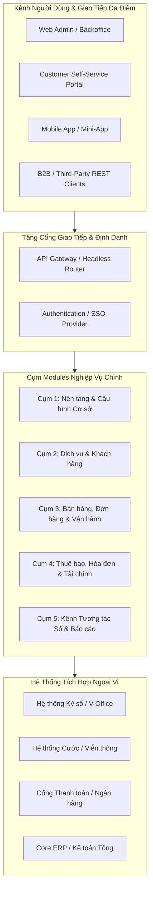
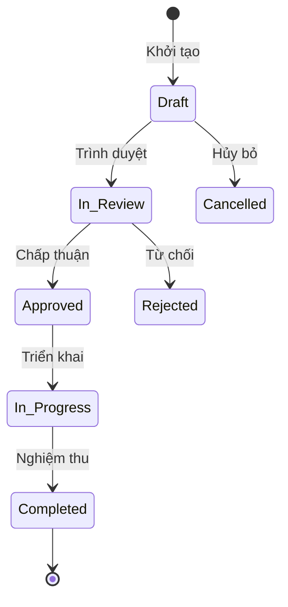
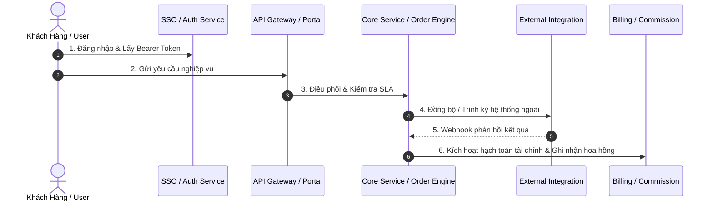

# SOT-GRAPH ARCHITECTURE REPORT TEMPLATE (Dual-Target: Human & AI)

> **Mục đích:** Bản mẫu chuẩn hóa 6 phần cho AI Agent / LLM khi nhận yêu cầu: *"Xuất báo cáo kiến trúc"*, *"Tổng quan hệ thống"*, *"Architecture Report"*.
> **Nguyên tắc Ingestion:** LLM CHỈ đọc các file Fact Bundle trong `.sot/bundle/` (`01_module_inventory.md`, `02_routing_endpoints.md`, `03_workflows_states.md`, `04_dependencies_violations.md`, `05_system_metrics.json`) và điền dữ liệu theo cấu trúc chuẩn dưới đây.

---

# [TÊN DỰ ÁN] — BÁO CÁO KIẾN TRÚC & PHÂN TÍCH HỆ THỐNG TOÀN DIỆN

**Nguồn phân tích:** Single Source of Truth (`sot-graph`)  
**Mục tiêu:** Bóc tách kiến trúc tổng thể, phân rã chi tiết 100% modules & chức năng con theo User Role, State Machine, Cron SLA và Khuyến nghị tối ưu.  
**Pattern & Modularity:** [Tên Pattern kiến trúc] — Modularity Score ($Q = [Score]$)

---

## 1. TỔNG QUAN HỆ THỐNG & SƠ ĐỒ CONTAINER TỔNG THỂ (C4-CONTAINER HLD)

### 1.1 Bản chất & Định vị Hệ thống
* Tóm tắt mục đích cốt lõi, đối tượng phục vụ, stack công nghệ chính (Backend, Frontend, Mobile, DB, SSO/Auth).

### 1.2 Sơ đồ C4 Container Tổng thể (Mermaid HLD)

---

## 2. PHÂN RÃ CHI TIẾT 100% MODULES NGHIỆP VỤ & TÍNH NĂNG CON (FEATURE TAXONOMY)

> **Cấu trúc bắt buộc:** Nhóm thành các **Cụm Bounded Contexts** logic. Trình bày **100% tất cả module con** không được bỏ sót bất kỳ module nào.

### CỤM [N]: [TÊN CỤM NGHIỆP VỤ]

#### Module [M]: `[module_name]` ([Tên Tiếng Việt])
* **Thư mục mã nguồn:** `[path/to/module/]`
* **Đối tượng sử dụng (User Roles):** [Ví dụ: Admin, Sales Manager, Tech Staff, Customer]
* **Entities / Models chính:** `model_1`, `model_2`, `model_3`
* **Endpoints / Routes / Handlers:** `GET/POST /api/v1/...`, `Controller/View Class`
* **Chức năng cụ thể (Đánh số chi tiết):**
1. **[Tên Chức năng 1]:** [Mô tả chi tiết cách thức xử lý, quy tắc nghiệp vụ, validation].
2. **[Tên Chức năng 2]:** [Mô tả chi tiết cách thức xử lý, quy tắc nghiệp vụ, validation].
3. **[Tên Chức năng 3]:** [Mô tả chi tiết cách thức xử lý, quy tắc nghiệp vụ, validation].

---

## 3. MA TRẬN PHÂN QUYỀN THEO VAI TRÒ NGƯỜI DÙNG (USER ROLE MATRIX)

| Phân hệ Nghiệp vụ | System Admin | Sales Manager | Sales Staff / AM | Tech Staff | Kế toán / Finance | Khách hàng (Portal/App) |
| :--- | :---: | :---: | :---: | :---: | :---: | :---: |
| **[Phân hệ 1]** | Toàn quyền | Xem & Duyệt | Thao tác | Không | Không | Xem dữ liệu cá nhân |
| **[Phân hệ 2]** | Toàn quyền | Giám sát | Không | Khảo sát / Lắp đặt | Không | Theo dõi tiến độ |
| **[Phân hệ 3]** | Toàn quyền | Xem doanh số | Không | Không | **Lập & Post Hóa đơn** | Thanh toán |

---

## 4. VÒNG ĐỜI STATE MACHINE & VẬN HÀNH TỰ ĐỘNG (WORKFLOWS & CRON JOBS)

### 4.1 State Machine Đơn hàng / Hợp đồng / Thực thể chính

### 4.2 Cơ chế Chạy ngầm Tự động (Cron Jobs, SLA Escalation & Background Workers)
* **Cron [Tên Cron]:** Chu kỳ quét, điều kiện kích hoạt, tác vụ tự động sinh đơn / cảnh báo SLA.

---

## 5. LUỒNG NGHIỆP VỤ XUYÊN SUỐT TOÀN HỆ THỐNG (END-TO-END SEQUENCE FLOW)

---

## 6. ĐÁNH GIÁ KIẾN TRÚC & LỘ TRÌNH TỐI ƯU HÓA (ROADMAP P0/P1/P2)

### 6.1 Các Điểm Mạnh Nổi Bật (Architectural Highlights)
1. **[Điểm mạnh 1]:** Đánh giá về tính Modularity, Separation of Concerns.
2. **[Điểm mạnh 2]:** Đánh giá về bảo toàn dữ liệu, tính nhất quán.
3. **[Điểm mạnh 3]:** Đánh giá về cơ chế tự động hóa và tích hợp.

### 6.2 Khuyến Nghị Tối Ưu Hóa Tiếp Theo (Actionable Roadmap)
* **Priority P0 (Bảo đảm Tin cậy & Critical Path):** [Mô tả chi tiết giải pháp kỹ thuật, ví dụ: Transactional Outbox, Lock mechanism].
* **Priority P1 (Hiệu năng & Khả năng Mở rộng):** [Mô tả chi tiết giải pháp kỹ thuật, ví dụ: Redis Caching, Batch query].
* **Priority P2 (Chất lượng Mã nguồn & Giám sát):** [Mô tả chi tiết giải pháp kỹ thuật, ví dụ: Composite Index, Health check].
